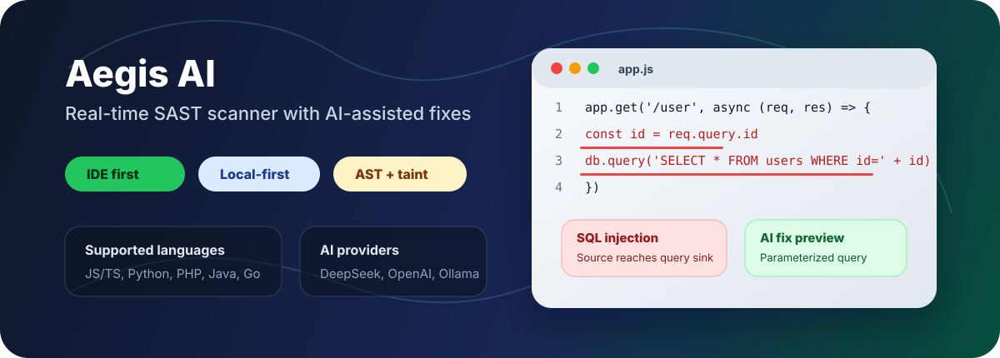

# Aegis AI

<p align="center">
  
</p>

<p align="center">
  <strong>Real-time security scanning for VS Code and Cursor, with AI-assisted fixes.</strong>
</p>

<p align="center">
  <a href="https://marketplace.visualstudio.com/items?itemName=wen-zai.aegis-ai-security">Install the VS Code extension</a>
  ·
  <a href="docs/VERIFICATION_GUIDE.md">Verify locally</a>
  ·
  <a href="docs/technical/DETECTION_QUALITY.md">Detection quality</a>
</p>

<p align="center">
  <a href="https://github.com/HWZ-499/aegis-ai/actions/workflows/security-scan.yml"></a>
  
  
  
</p>

## What It Does

Aegis AI catches common application security issues while you write code. It runs locally through an LSP backend, surfaces diagnostics inside the editor, and can generate framework-aware fix suggestions through DeepSeek, OpenAI, Ollama, or a custom compatible endpoint.

| Capability | Product behavior |
|---|---|
| Real-time IDE scanning | Diagnostics appear in VS Code / Cursor on save or command-triggered scans. |
| AST + taint analysis | Tree-sitter parsing and source-to-sink reasoning reduce regex-only noise. |
| AI-assisted remediation | Fix previews and remediation comments are available from editor actions. |
| Suppression workflow | `.aegis-baseline.json` and `aegis-ignore` keep accepted risk separate from fixed code. |
| CI-ready output | CLI supports JSON, HTML, Markdown, and SARIF report flows. |

## Coverage

| Language | Status |
|---|---|
| JavaScript / TypeScript | AST rules, taint-aware checks, IDE and CLI support |
| Python | AST rules, framework-aware sources and sinks, IDE and CLI support |
| PHP | Tree-sitter AST rules and taint-aware checks |
| Java / Go | Core multi-language rule support |
| C / C++ | Basic scan path support; not yet full AST or taint coverage |

Detected categories include SQL injection, NoSQL injection, XSS, command execution, path traversal, deserialization, SSRF, open redirect, hardcoded credentials, and buffer overflow patterns.

## Install

For normal use, install the extension from the Marketplace:

1. Open VS Code or Cursor.
2. Search for `Aegis AI Security Scanner`.
3. Install `wen-zai.aegis-ai-security`.
4. Open a supported file and run `Aegis: Scan Current File` or save the file.

The extension bundles the Python backend and creates its own managed runtime. Most users do not need to clone this repository.

## Optional AI Fixes

AI fixes are optional. Configure one provider when you want generated remediation suggestions:

```powershell
$env:AI_PROVIDER = "deepseek"
$env:DEEPSEEK_API_KEY = "your_key"

# or local Ollama
$env:AI_PROVIDER = "ollama"
$env:OLLAMA_BASE_URL = "http://localhost:11434/v1"
$env:OLLAMA_MODEL = "qwen2.5-coder"
```

Code action requests are explicit user actions. Opening a file or viewing a diagnostic does not automatically send code to an AI provider.

## CLI

Use the Python core directly for local scans or CI:

```powershell
cd aegis-ai-core
pip install -e .

python -m src.scanner.cli C:\path\to\project --format json
python -m src.scanner.cli C:\path\to\project --format html --output report.html
python -m src.scanner.cli C:\path\to\project --format sarif --output results.sarif
```

## Quality Signals

Latest reproducible real-project baseline:

| Target | Snapshot | Language | Recall | Precision | F1 |
|---|---|---:|---:|---:|---:|
| DVWA | 2026-07-12 | PHP | 100.0% | 44.2% | 0.61 |
| NodeGoat | 2026-07-12 | JavaScript | 100.0% | 85.7% | 0.92 |

These clean-worktree reports record scanner/target revisions, dirty state, ground-truth SHA-256, runtime environment, scan duration, peak RSS, and auditable TP/FP/FN/TN details. Historical reports under `aegis-ai-core/scripts/reports/` are not comparable unless rerun with the same provenance contract. See [Detection Quality](docs/technical/DETECTION_QUALITY.md) for the evaluation workflow and regression process.

## Repository

| Path | Purpose |
|---|---|
| `aegis-ai-core/` | Python scanner, rule engine, LSP server, CLI, tests, benchmark scripts |
| `aegis-vscode/` | VS Code / Cursor extension |
| `docs/` | Verification and detection-quality documentation |
| `.github/workflows/` | Release and benchmark automation |

## Development

```powershell
cd aegis-ai-core
python -m pytest tests/
ruff check src tests
ruff format --check src tests
python scripts/typecheck_gate.py --group ci

cd ..\aegis-vscode
npm run check
```

Rule behavior changes should include focused true-positive or false-positive fixtures under `aegis-ai-core/tests/rules/`.

## License

MIT
