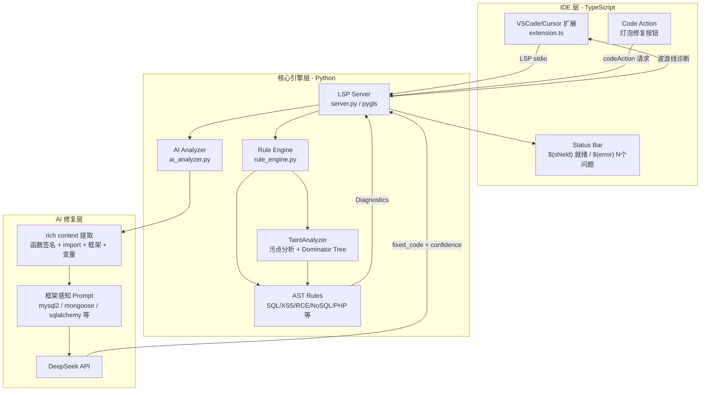
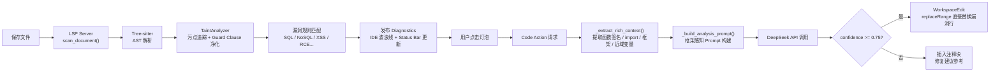

# Aegis AI — IDE 实时安全扫描 + AI 精准修复

[](https://github.com/aegis-ai/aegis-ai/actions/workflows/security-scan.yml)
[](https://opensource.org/licenses/MIT)
[](https://www.python.org/downloads/)
[](https://pypi.org/project/aegis-ai-core/)

> 开源的 VSCode/Cursor 安全扫描插件，在编写代码的同时实时检测漏洞，并由 AI 生成框架感知的精准修复建议。

**当前版本**: v1.2.0 | **扩展 ID**: `aegis-ai.aegis-ai-security` | **状态**: 积极开发中 | [查看路线图 →](ROADMAP.md)

---

## 核心特性

- **IDE 实时扫描**：基于 LSP（Language Server Protocol），保存文件时自动扫描，秒级反馈
- **Status Bar 状态显示**：`$(shield) 就绪` / `$(loading~spin) 扫描中` / `$(error) N 个问题` / `$(check) 安全`
- **AI 精准修复**：Code Action 直接替换漏洞行（置信度 >= 0.75），生成复用原变量名和框架 API 的修复代码
- **框架感知**：自动识别 mysql2、Sequelize、Mongoose、pymysql、SQLAlchemy 等框架，提供专用修复示例
- **多语言支持**：JavaScript / TypeScript / Python / PHP / Java / Go（全部已升级为完整 AST + 污点分析）
- **多漏洞类型**：SQL 注入、NoSQL 注入、XSS、RCE、路径穿越、反序列化、硬编码凭证、SSRF（CWE-918）、开放重定向 — 共 9 类
- **多层分析管道**：正则扫描 → AST 分析 → 污点追踪（Guard Clause + Dominator Tree）→ AI 增强
- **CI/CD 集成**：GitHub Actions + GitLab CI，支持 SARIF 格式上报

---

## 快速开始

### 安装核心引擎（二选一）

- **从 PyPI 安装（推荐）**：`pip install aegis-ai-core`，安装后可直接使用 `aegis-scan`、`aegis-lsp` 命令。
- **从源码安装**：`cd aegis-ai-core && pip install -e .`

### 方式一：VSCode/Cursor 扩展（推荐）

#### 1. 安装 Python 依赖

若未通过 PyPI 安装，请在本仓库中执行：

```bash
cd aegis-ai-core
pip install -r requirements.txt
```

#### 2. 配置 AI 提供商（可选，用于 AI 修复功能）

**选项 A：使用本地 Ollama（免费，无需 API Key）**
```bash
# 安装 Ollama 后：
ollama pull llama3
export AI_PROVIDER=ollama
```

**选项 B：使用 DeepSeek API（低成本，推荐）**
```bash
# Windows
set DEEPSEEK_API_KEY=your_api_key_here

# macOS / Linux
export DEEPSEEK_API_KEY=your_api_key_here

# 或创建 .env 文件
echo "DEEPSEEK_API_KEY=your_api_key_here" > aegis-ai-core/.env
```

**选项 C：使用 OpenAI API**
```bash
export AI_PROVIDER=openai
export OPENAI_API_KEY=your_openai_key
```

#### 3. 安装 VSCode 扩展

```bash
# 在 VSCode/Cursor 中安装 .vsix 包
code --install-extension aegis-vscode/aegis-ai-security-0.2.0.vsix
```

或在 VSCode 中：`Ctrl+Shift+P` → `Extensions: Install from VSIX...` → 选择 `aegis-ai-security-0.2.0.vsix`

#### 4. 配置扩展（可选）

在 VSCode 设置中搜索 `aegisAI`，可配置：

| 设置项 | 默认值 | 说明 |
|--------|--------|------|
| `aegisAI.pythonPath` | `python` | Python 可执行文件路径 |
| `aegisAI.serverCwd` | 自动推断 | `aegis-ai-core` 目录路径 |
| `aegisAI.enabled` | `true` | 是否启用扩展 |

#### 5. 开始使用

打开任意 `.js`、`.ts`、`.py`、`.php`、`.java` 或 `.go` 文件，保存后 Aegis AI 自动扫描。漏洞将显示为波浪线诊断，点击灯泡图标可查看修复建议。

---

### 方式二：CLI 命令行扫描

```bash
cd aegis-ai-core

# 扫描指定目录，输出 JSON
python -m src.scanner.cli /path/to/project --format json

# 输出 HTML 报告
python -m src.scanner.cli /path/to/project --format html --output report.html

# 增量扫描（只扫描 Git 修改的文件）
python -m src.scanner.cli . --incremental --format json
```

---

### 方式三：Python API

```python
from src.scanner.project_scanner import ProjectScanner
from src.analysis.rule_engine import analyze_javascript, analyze_python

# 扫描项目
scanner = ProjectScanner("/path/to/project")
results = scanner.scan_project(verbose=True)

# 单文件扫描
findings = analyze_javascript(source_code, "app.js")
for f in findings:
    print(f"[{f['severity']}] {f['type']} at line {f['line']}: {f['details']}")
```

---

## 整体架构



## 扫描工作流



## 配置 AI 提供商

Aegis AI 支持多种 AI 提供商进行智能代码修复，通过 `AI_PROVIDER` 环境变量选择：

| 提供商 | 设置方式 | 适用场景 |
|--------|---------|---------|
| **DeepSeek**（默认）| `export DEEPSEEK_API_KEY=xxx` | 成本低，中文支持好 |
| **OpenAI** | `export AI_PROVIDER=openai && export OPENAI_API_KEY=xxx` | GPT-4o 强推理能力 |
| **Ollama**（本地免费）| `export AI_PROVIDER=ollama` | 离线使用，保护代码隐私 |
| **自定义端点** | `export AI_PROVIDER=custom && export AI_BASE_URL=xxx && export AI_API_KEY=xxx` | 企业私有化部署 |

### 使用本地 Ollama（免费，无需联网）

```bash
# 1. 安装并启动 Ollama
brew install ollama && ollama serve

# 2. 拉取模型
ollama pull llama3  # 或 qwen2.5-coder, deepseek-r1 等

# 3. 告知 Aegis 使用 Ollama
export AI_PROVIDER=ollama
# 可选：自定义模型（默认 llama3）
export OLLAMA_MODEL=qwen2.5-coder

# 4. 正常使用，无需 API Key
aegis-scan ./your_project
```

---

## 内联抑制注释（aegis-ignore）

对于误报或已知接受的风险，可在代码行添加 `aegis-ignore` 注释来抑制该行的告警：

```python
# 行末注释：抑制该行所有漏洞
response = requests.get(trusted_internal_url)  # aegis-ignore

# 行末注释：仅抑制该行的特定类型
response = requests.get(validated_url)  # aegis-ignore: SSRF

# 行上方注释：抑制下一行（适合代码较长时）
# aegis-ignore: SQL_INJECTION
cursor.execute(pre_validated_query)
```

同样适用于 JavaScript/TypeScript/Java/Go/PHP：

```javascript
const resp = await fetch(allowlistedUrl); // aegis-ignore: SSRF
```

---


```
aegis-ai/
├── aegis-ai-core/              # Python 核心引擎
│   ├── src/
│   │   ├── analysis/           # 静态分析引擎
│   │   │   ├── analyzers/      # 语言分析器（JS/TS/Python/PHP/Java/Go）
│   │   │   ├── taint/          # 污点分析（TaintAnalyzer、CrossFileAnalyzer）
│   │   │   ├── rules/          # 漏洞规则（SQL/XSS/RCE/NoSQL/反序列化 等）
│   │   │   ├── cfg/            # 控制流图 + 支配树（Dominator Tree）
│   │   │   ├── dsl/            # DSL 规则引擎（YAML 自定义规则）
│   │   │   └── base/           # 规则基类 + Finding 模型
│   │   ├── lsp/                # LSP Server（pygls）
│   │   ├── scanner/            # 扫描器、AI 分析器、RAG 增强、基线管理
│   │   └── core/               # 配置管理（pydantic-settings）
│   ├── scripts/                # 基准测试、评估、调试脚本
│   ├── tests/                  # 测试套件（pytest）
│   ├── data/                   # CVE 知识库数据
│   └── requirements.txt
│
├── aegis-vscode/               # VSCode/Cursor 扩展（TypeScript）
│   ├── src/extension.ts        # 扩展主文件
│   ├── README.md               # Marketplace 展示页
│   └── CHANGELOG.md            # 版本历史
│
├── docs/                       # 技术文档
└── README.md
```

---

## 技术栈

| 层级 | 技术 |
|------|------|
| IDE 扩展 | TypeScript, VSCode API, vscode-languageclient |
| LSP Server | Python, pygls, lsprotocol |
| 静态分析 | Tree-sitter AST（JS/TS/Python/PHP/Java/Go 全部完整 AST 分析）|
| 污点分析 | 自研 TaintGraph + Dominator Tree（单文件内）|
| AI 修复 | DeepSeek API（兼容 OpenAI SDK）|
| RAG 知识库 | ChromaDB + sentence-transformers（实验性，可选，已从核心依赖移除）|
| 配置管理 | pydantic-settings + .env |
| CI/CD | GitHub Actions, GitLab CI, SARIF |
| 代码质量 | ruff（lint + format）, mypy, pytest |

---

## 代码质量

v1.2.0 进行了一轮全面的代码质量优化：

- **异常处理收紧**：120+ 处 `except Exception` 宽泛捕获收紧为具体异常类型（`OSError`、`ImportError`、`ValueError` 等），仅保留 7 处有意的顶层防御性捕获
- **Bug 修复**：修复 `false_positive_manager` 的 `created_at` 时间戳 bug（此前存储的是工作目录路径）
- **安全加固**：CORS 默认值从 `*` 收紧为 localhost、VSCode Webview 注入 CSP 防止 XSS
- **模块卫生**：`aegis_server.py` ChromaDB 延迟初始化（避免 import 副作用）、`rag_system.py` 加入 `__main__` 保护
- **导入迁移**：废弃模块 `ast_analyzer` / `security_rules` 的导入统一迁移至 `rule_engine`
- **测试规范化**：10 个测试文件从脚本式 / 混合式风格统一为标准 pytest
- **依赖声明**：`openai` 可选依赖在 `requirements.txt` 中明确标注

详细优化记录见 [docs/technical/OPTIMIZATION_PLAN.md](docs/technical/OPTIMIZATION_PLAN.md)。

---

## 已知局限

| 问题 | 影响 | 状态 |
|------|------|------|
| `tree-sitter==0.21.3` 启动时产生 `FutureWarning` | 无功能影响，LSP 入口已过滤 | 已缓解 |

---

## 基准测试结果

在多个真实漏洞靶场上的测试结果（2026-03-13 最新评估）：

| 目标 | 语言 | 扫描文件 | Recall | Precision | F1 |
|------|------|---------|--------|-----------|-----|
| **NodeGoat (OWASP)** | JavaScript | 9 | **100%** | **100%** | **1.00** |
| django-3.2-core | Python | 97 | 92.3% | 92.3% | **0.92** |
| DVWA | PHP | 177 | 100% | 45.3% | **0.62** |
| flask-2.3.2 | Python | 0* | 66.7% | 50.0% | 0.57 |

*\*flask-2.3.2 的漏洞在配置解析逻辑中，scanner 当前不扫描 .cfg 文件*

**NodeGoat 历史进展**（主要指标 F1）：

| 评估版本 | 日期 | NoSQL TP | 总 TP | FP | Recall | F1 |
|---------|------|---------|--------|-----|--------|-----|
| v1 | 2026-02-08 | 0 | 3 | 13 | 50% | 0.27 |
| v3 | 2026-03-02 | 1 | 4 | 12 | 66.7% | 0.36 |
| v6 | 2026-03-02 | 3 | 8 | 10 | 100% | 0.62 |
| **v7 (当前)** | **2026-03-13** | **5** | **12** | **0** | **100%** | **1.00** |

---

## 开发状态

### 已完成

- 核心静态分析引擎（JS/TS/Python/PHP/Java/Go 全部完整 AST + 污点分析）
- 污点分析系统（TaintGraph + Guard Clause + Dominator Tree）
- LSP Server（实时诊断 + Code Action + Status Bar）
- AI 精准修复（框架感知 prompt + rich context 提取，置信度 >= 0.75 直接替换）
- **多 AI 提供商支持**：DeepSeek（默认）、OpenAI、Ollama（本地免费离线）、自定义端点
- VSCode/Cursor 扩展（含 Findings TreeView、Status Bar、命令面板）
- 真实靶场基准测试（NodeGoat、DVWA、Django、Flask），**NodeGoat F1 达到 1.00（12 TP / 0 FP）**
- `tests/rules/` 正/负样本测试套件（9 类漏洞，85 个参数化测试用例，430 总测试通过）
- **SSRF 检测（CWE-918）**：Python（requests/urllib/httpx）+ JavaScript（fetch/axios/http.get）
- **内联抑制注释**：`# aegis-ignore` / `// aegis-ignore` 支持行末和行上方两种格式，可按漏洞类型过滤
- 基线管理 + 增量扫描 + 自定义规则目录
- v1.2.0 代码质量大扫除（异常处理、模块卫生、测试规范化）

### 实验性功能

- **DSL 规则引擎**：YAML 格式自定义规则（PoC 阶段，当前仅 4 条规则）

### 规划中

- VS Code Marketplace 上架
- DVWA 精度优化

---

## 贡献

欢迎提交 Issue 和 Pull Request。参与本项目即表示同意遵守我们的 [行为准则（Code of Conduct）](CODE_OF_CONDUCT.md)。安全相关问题请参见 [SECURITY.md](SECURITY.md)。

在提交 PR 之前，请确保：
1. 运行测试套件：`cd aegis-ai-core && python -m pytest tests/ -v`
2. 通过 lint 检查：`cd aegis-ai-core && ruff check src/ tests/`
3. 新规则需提供正样本（应报告）和负样本（不应报告）测试用例
4. TypeScript 扩展修改后需重新编译：`cd aegis-vscode && npm run compile`

---

## 许可证

MIT License

---

*最后更新: 2026-03-13 — v1.3.0 PHP 升级为完整 AST 分析，NodeGoat F1 达到 1.00，430 测试全通过*
