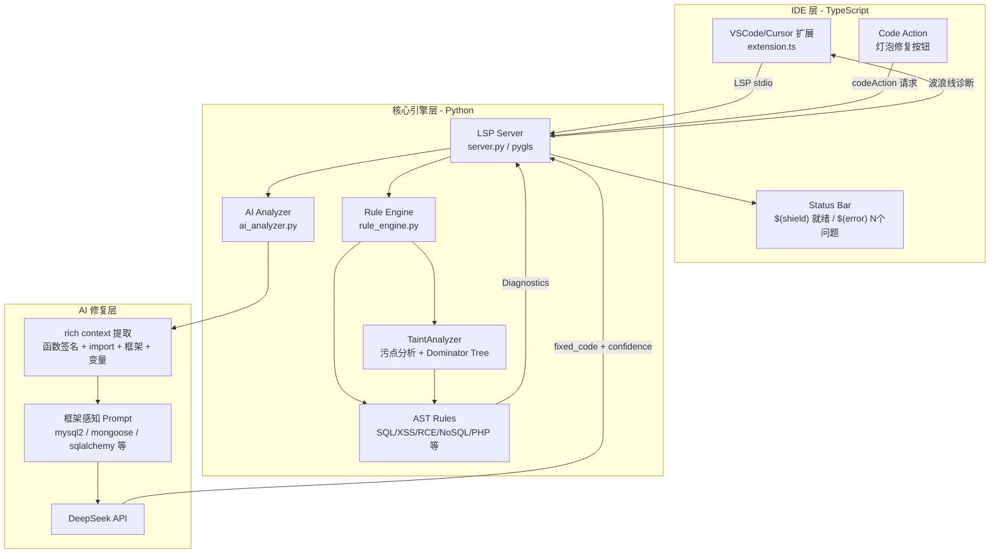
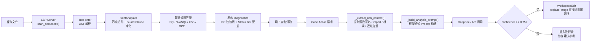

# Aegis AI — IDE 实时安全扫描 + AI 精准修复

[](https://github.com/aegis-ai/aegis-ai/actions/workflows/security-scan.yml)
[](https://opensource.org/licenses/MIT)
[](https://www.python.org/downloads/)
[](https://pypi.org/project/aegis-ai-core/)

> 开源的 VSCode/Cursor 安全扫描插件，在编写代码的同时实时检测漏洞，并由 AI 生成框架感知的精准修复建议。

**当前版本**: v0.2.0 | **扩展 ID**: `aegis-ai.aegis-ai-security` | **状态**: 预览版，积极开发中 | [查看路线图 →](ROADMAP.md)

<!-- 演示 GIF：录制后放置于 docs/assets/demo.gif，详见 docs/guides/DEMO_GIF.md -->


---

## 核心特性

- **IDE 实时扫描**：基于 LSP（Language Server Protocol），保存文件时自动扫描，秒级反馈
- **Status Bar 状态显示**：`$(shield) 就绪` / `$(loading~spin) 扫描中` / `$(error) N 个问题` / `$(check) 安全`
- **AI 精准修复**：Code Action 直接替换漏洞行（置信度 >= 0.75），生成复用原变量名和框架 API 的修复代码
- **框架感知**：自动识别 mysql2、Sequelize、Mongoose、pymysql、SQLAlchemy 等框架，提供专用修复示例
- **多语言支持**：JavaScript / TypeScript / Python / PHP（基于 Tree-sitter AST）
- **多漏洞类型**：SQL 注入、NoSQL 注入、XSS、RCE、路径穿越、反序列化、硬编码凭证等 10+ 种
- **污点分析**：跨函数污点追踪、Guard Clause 净化识别、Dominator Tree 支持
- **CI/CD 集成**：GitHub Actions + GitLab CI，支持 SARIF 格式上报

---

## 快速开始

### 安装核心引擎（二选一）

- **从 PyPI 安装（推荐）**：`pip install aegis-ai-core`，安装后可直接使用 `aegis-scan`、`aegis-lsp` 命令。
- **从源码安装**：`cd aegis-ai-core && pip install -e .`

### 方式一：VSCode/Cursor 扩展（推荐）

#### 1. 安装 Python 依赖

若未通过 PyPI 安装，请在本仓库中执行：

```bash
cd aegis-ai-core
pip install -r requirements.txt
```

#### 2. 配置 API Key（可选，用于 AI 修复功能）

```bash
# Windows
set DEEPSEEK_API_KEY=your_api_key_here

# macOS / Linux
export DEEPSEEK_API_KEY=your_api_key_here

# 或创建 .env 文件（推荐）
echo "DEEPSEEK_API_KEY=your_api_key_here" > aegis-ai-core/.env
```

#### 3. 安装 VSCode 扩展

```bash
# 在 VSCode/Cursor 中安装 .vsix 包
code --install-extension aegis-vscode/aegis-ai-security-0.2.0.vsix
```

或在 VSCode 中：`Ctrl+Shift+P` → `Extensions: Install from VSIX...` → 选择 `aegis-ai-security-0.2.0.vsix`

#### 4. 配置扩展（可选）

在 VSCode 设置中搜索 `aegisAI`，可配置：

| 设置项 | 默认值 | 说明 |
|--------|--------|------|
| `aegisAI.pythonPath` | `python` | Python 可执行文件路径 |
| `aegisAI.serverCwd` | 自动推断 | `aegis-ai-core` 目录路径 |
| `aegisAI.enabled` | `true` | 是否启用扩展 |

#### 5. 开始使用

打开任意 `.js`、`.ts`、`.py` 或 `.php` 文件，保存后 Aegis AI 自动扫描。漏洞将显示为波浪线诊断，点击灯泡图标可查看修复建议。

---

### 方式二：CLI 命令行扫描

```bash
cd aegis-ai-core

# 扫描指定目录，输出 JSON
python -m src.scanner.cli /path/to/project --format json

# 输出 HTML 报告
python -m src.scanner.cli /path/to/project --format html --output report.html

# 增量扫描（只扫描 Git 修改的文件）
python -m src.scanner.cli . --incremental --format json
```

---

### 方式三：Python API

```python
from src.scanner.project_scanner import ProjectScanner
from src.analysis.rule_engine import analyze_javascript, analyze_python

# 扫描项目
scanner = ProjectScanner("/path/to/project")
results = scanner.scan_project(verbose=True)

# 单文件扫描
findings = analyze_javascript(source_code, "app.js")
for f in findings:
    print(f"[{f['severity']}] {f['type']} at line {f['line']}: {f['details']}")
```

---

## 整体架构



## 扫描工作流



---

## 项目结构

```
aegis-ai/
├── aegis-ai-core/              # Python 核心引擎
│   ├── src/
│   │   ├── analysis/           # 静态分析引擎
│   │   │   ├── taint/          # 污点分析（TaintAnalyzer、CFG、DominatorTree）
│   │   │   ├── rules/          # 漏洞规则（SQL、XSS、RCE、NoSQL、PHP 等）
│   │   │   ├── analyzers/      # 语言分析器（JS/TS/Python/PHP）
│   │   │   └── cfg/            # 控制流图 + 支配树
│   │   ├── lsp/                # LSP Server（pygls）
│   │   ├── scanner/            # 扫描器、AI 分析器、RAG 增强
│   │   └── server/             # FastAPI HTTP 服务（可选）
│   ├── scripts/                # 基准测试、评估脚本
│   ├── tests/                  # 测试套件（pytest）
│   └── requirements.txt
│
├── aegis-vscode/               # VSCode/Cursor 扩展（TypeScript）
│   ├── src/extension.ts        # 扩展主文件
│   ├── README.md               # Marketplace 展示页
│   ├── CHANGELOG.md            # 版本历史
│   └── aegis-ai-security-0.2.0.vsix  # 打包好的扩展
│
└── README.md
```

---

## 技术栈

| 层级 | 技术 |
|------|------|
| IDE 扩展 | TypeScript, VSCode API, vscode-languageclient |
| LSP Server | Python, pygls, lsprotocol |
| 静态分析 | Tree-sitter（JS/TS/PHP/Python AST）|
| 污点分析 | 自研 TaintGraph + Dominator Tree |
| AI 修复 | DeepSeek API（兼容 OpenAI SDK）|
| RAG 知识库 | ChromaDB + sentence-transformers（可选）|
| CI/CD | GitHub Actions, GitLab CI, SARIF |

---

## 已知问题

| 问题 | 影响 | 状态 |
|------|------|------|
| `tree-sitter==0.21.3` 启动时产生 `FutureWarning: Language(path, name) is deprecated` | 无功能影响，纯日志噪音；LSP Server 启动入口已过滤，不影响 stdio 通信 | 已缓解，待 tree-sitter-languages 兼容 >=0.22 后升级 |
| PHP 污点分析基于行扫描（非完整 AST 路径分析） | PHP 检出率低于 JS/Python | 规划中 |
| 跨文件污点传播仅支持 `module.exports` 函数 | 复杂依赖链场景可能漏报 | 规划中 |

---

## 基准测试结果

在多个真实漏洞靶场上的测试结果（2026-03-02 最新评估）：

| 目标 | 语言 | 扫描文件 | Recall | Precision | F1 |
|------|------|---------|--------|-----------|-----|
| **NodeGoat (OWASP)** | JavaScript | 9 | **100%** | 44.4% | **0.62** |
| django-3.2-core | Python | 97 | 92.3% | 92.3% | **0.92** |
| DVWA | PHP | 177 | 100% | 45.3% | **0.62** |
| flask-2.3.2 | Python | 0* | 66.7% | 50.0% | 0.57 |

*\*flask-2.3.2 的漏洞在配置解析逻辑中，scanner 当前不扫描 .cfg 文件*

**NodeGoat 历史进展**（主要指标 F1）：

| 评估版本 | 日期 | NoSQL TP | 总 TP | FP | Recall | F1 |
|---------|------|---------|--------|-----|--------|-----|
| v1 | 2026-02-08 | 0 | 3 | 13 | 50% | 0.27 |
| v3 | 2026-03-02 | 1 | 4 | 12 | 66.7% | 0.36 |
| **v6 (当前)** | **2026-03-02** | **3** | **8** | **10** | **100%** | **0.62** |

改进来源：NoSQL `insert` 变量参数 DAO 感知检测、`$set` 嵌套操作符污点追踪、ground truth 补充 HARDCODED_CREDENTIALS 漏洞。

---

## 开发状态

### 已完成

- 核心静态分析引擎（JS/TS/Python/PHP，基于 Tree-sitter AST）
- 污点分析系统（TaintGraph + Guard Clause + Dominator Tree，跨函数追踪）
- LSP Server（实时诊断 + Code Action + Status Bar）
- AI 精准修复（框架感知 prompt + rich context 提取，置信度 ≥ 0.75 直接替换）
- VSCode/Cursor 扩展（v0.2.0，含 LICENSE、README、CHANGELOG）
- 真实靶场基准测试（NodeGoat、DVWA、Django、Flask），NodeGoat F1 达到 0.62
- `tests/rules/` 正/负样本测试套件（7 类漏洞，19 个参数化测试用例，100% 通过）
- NoSQL 检测增强：DAO insert 变量参数、update `$set` 嵌套、guard clause 作用域修复

### 规划中

- 开源社区发布：完善贡献指南、issue 模板、演示 GIF
- PHP AST 分析升级：接入 Tree-sitter PHP 完整路径分析
- 跨文件污点传播增强：支持复杂模块依赖链
- Java / Go 语言支持

---

## 贡献

欢迎提交 Issue 和 Pull Request。参与本项目即表示同意遵守我们的 [行为准则（Code of Conduct）](CODE_OF_CONDUCT.md)。安全相关问题请参见 [SECURITY.md](SECURITY.md)。

在提交 PR 之前，请确保：
1. 运行测试套件：`cd aegis-ai-core && python -m pytest tests/ -v`
2. 新规则需提供正样本（应报告）和负样本（不应报告）测试用例
3. TypeScript 扩展修改后需重新编译：`cd aegis-vscode && npm run compile`

---

## 许可证

MIT License

---

*最后更新: 2026-03-02 — v0.2.0 发布，NodeGoat F1 从 0.36 提升至 0.62，Recall 达到 100%*
