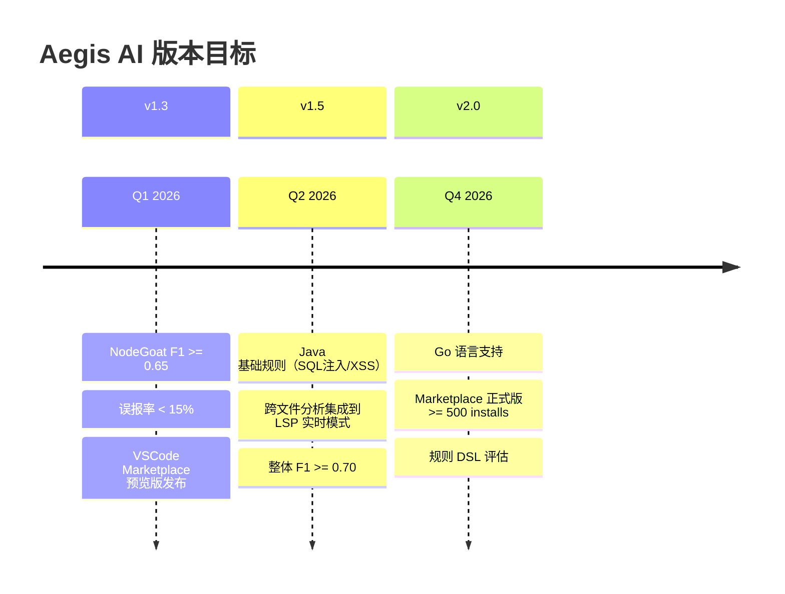
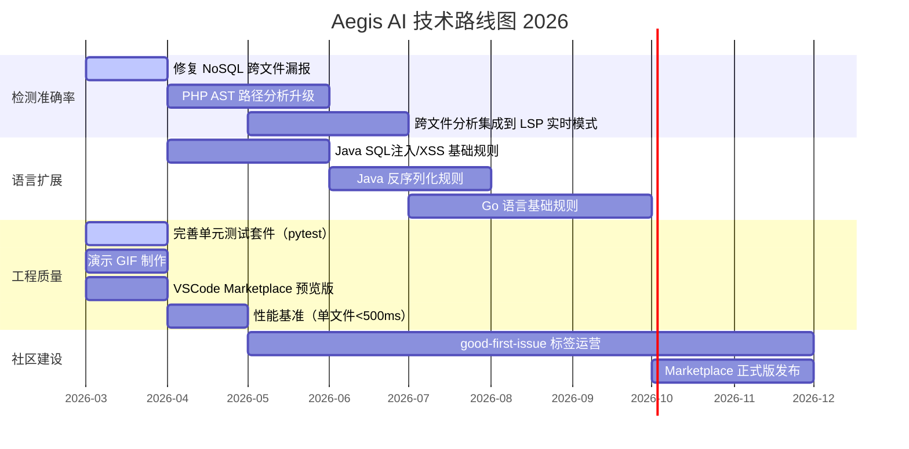

# Aegis AI — Roadmap

> 本文档描述 Aegis AI 的产品定位、技术发展方向、量化目标和已知技术债务。  
> 路线图按季度滚动更新，欢迎通过 [Issue](https://github.com/how-about-that/aegis-ai/issues) 参与讨论。

**最后更新**: 2026-03-05 | **当前版本**: v1.2

---

## 目录

- [项目定位与差异化](#项目定位与差异化)
- [当前状态快照](#当前状态快照v12)
- [量化目标](#量化目标)
- [技术路线图](#技术路线图)
- [技术债务清单](#技术债务清单)

---

## 项目定位与差异化

Aegis AI 的核心定位：**面向开发者的本地轻量化 IDE 安全助手**。

与主流工具的差异化对比：

| 维度 | Aegis AI | Semgrep | ESLint-plugin-security | Snyk / SonarQube |
|------|----------|---------|------------------------|------------------|
| 运行环境 | 本地，无需云端 | 需要 Semgrep 云 / CLI | 仅 Node.js 本地 | 云端扫描为主 |
| 配置成本 | 零配置，开箱即用 | 需要学习规则 DSL（YAML） | 需要 ESLint 配置 | 需要注册账号 + 项目接入 |
| AI 修复 | 上下文感知精准修复 | 无 | 无 | 有，但为商业功能 |
| 框架感知 | 是（mysql2/Mongoose/SQLAlchemy 等）| 部分（规则级别） | 否 | 是（有限） |
| 实时反馈 | LSP 保存即扫描，秒级 | CLI / CI 为主 | ESLint 实时 | CI/CD 为主 |
| 语言支持 | JS/TS/Python/PHP/Java/Go（当前 LSP 实时模式仅覆盖 JS/TS/Python/PHP） | 30+ 语言 | 仅 JS | 20+ 语言 |
| 开源 | MIT | LGPL-2.1（规则闭源部分） | MIT | 闭源 |

**核心差异化**：无需配置文件，保存代码即可获得安全诊断 + AI 生成的、复用当前代码上下文（变量名、框架 API）的精准修复建议。

---

## 当前状态快照（v1.2）

### 已实现

- **IDE 实时扫描**：基于 LSP（pygls），保存触发，Status Bar 实时反馈
- **多语言 AST 分析**：JS/TS/Python/PHP（Tree-sitter）
- **污点分析**：跨函数追踪、Guard Clause 净化、Dominator Tree
- **漏洞类型**：SQL 注入、NoSQL 注入、XSS、RCE、路径穿越、反序列化、硬编码凭证（10+ 种）
- **AI 精准修复**：rich context 提取（函数签名、imports、框架、近域变量）+ 框架感知 Prompt + 高置信度直接替换
- **CI/CD 集成**：GitHub Actions + GitLab CI + SARIF 格式
- **基准测试基础设施**：NodeGoat、DVWA、flask 靶场基准

### 已知限制

| 限制 | 影响范围 | 目标版本 |
|------|----------|----------|
| NodeGoat F1 仍有提升空间（当前精度接近目标但未系统公布）| 整体 Recall / Precision | v1.3 |
| LSP 实时模式目前仅对 JS/TS/Python/PHP 触发扫描，Java/Go 仅在 CLI/批量扫描中可用 | IDE 内 Java/Go 场景暂无诊断 | v1.4 |
| PHP 污点分析基于行扫描，非完整 AST 路径 | PHP 检出率低于 JS/Python | v1.5 |

---

## 量化目标

| 版本 | 目标 | 关键指标 |
|------|------|----------|
| v1.3 | 提升 JS/TS 检测准确率 | NodeGoat F1 ≥ 0.65，误报率 < 15% |
| v1.4 | 跨文件分析 + LSP 集成 | LSP 模式下跨文件场景 recall 提升 ≥ 20% |
| v1.5 | Java 语言支持 | SQL 注入 + XSS 基础规则，WebGoat F1 ≥ 0.60 |
| v2.0 | 正式发布 + 社区增长 | VSCode Marketplace installs ≥ 500，GitHub Star ≥ 100 |

---

## 技术路线图

### Q1 2026（当前）

**目标：提升核心准确率，准备公开展示**

- [x] 修复 NoSQL 嵌套对象污点传播（`memos-dao.js`、`benefits-dao.js` 漏报），将 NodeGoat F1 提升至接近 ≥ 0.65 的目标区间
- [ ] 为每个漏洞规则补充独立的正/负测试用例（`tests/rules/` 目录，当前 JS/PHP/Java/Go 已基本覆盖，Python 仍待补齐）
- [ ] 制作演示 GIF：完整展示“编写漏洞代码 → 保存 → 诊断出现 → 点击修复 → AI 生成修复代码 → 一键替换”流程
- [x] 发布 VSCode Marketplace 预览版（Extension ID: `aegis-ai.aegis-ai-security`）
- [x] 完善 `README.md` 的基准数据，替换当前模糊的“从 0% 提升”描述，并给出 NodeGoat/DVWA/django/flask F1/Recall/Precision 数据

### Q2 2026

**目标：扩展语言支持，深化分析能力**

- [ ] Java 语言支持：基于 `tree-sitter-java` 实现 SQL 注入 + XSS 基础 AST 规则
- [ ] 跨文件分析集成到 LSP 实时扫描流程（当前 `cross_file_analyzer.py` 仅在 CLI 模式运行）
- [ ] 性能基准验证：单文件扫描 < 500ms，中型项目（100 文件）< 30s
- [ ] 完善 `module.exports` 以外的导入模式支持（ES Module `import/export`、CommonJS 动态 `require`）

### Q3 2026

**目标：Go 支持 + CI/CD 增强 + 社区建设**

- [ ] Go 语言基础规则（SQL 注入、命令注入）
- [ ] 优化 SARIF 输出格式，对接 GitHub Security Dashboard（Code Scanning Alerts）
- [ ] 建立 `good-first-issue` 标签体系，吸引第一批外部贡献者
- [ ] Java 反序列化规则（基于 `ObjectInputStream` 模式）

### Q4 2026

**目标：正式发布 + v2.0 架构评估**

- [ ] VSCode Marketplace 正式版发布，目标 500+ installs
- [ ] 扩展基准测试覆盖：WebGoat（Java）、Juice Shop（Node.js）
- [ ] v2.0 架构评估：是否引入规则 DSL（类 Semgrep YAML），降低规则编写门槛
- [ ] 评估 LSP 协议外的触发机制（如文件级实时 lint，不依赖保存）

---

## 技术债务清单

以下是已知的技术债务，按优先级排序。在提交 PR 时可认领其中的条目。

### 高优先级（影响核心可信度）

| # | 问题 | 文件 | 影响 |
|---|------|------|------|
| TD-01 | NoSQL 嵌套对象/跨文件污点传播不完整，导致 `memos-dao.js`、`benefits-dao.js` 漏报 | `rules/nosql_injection/javascript_ast_rule.py` | NodeGoat Recall 低 |
| TD-02 | `cross_file_analyzer.py` 未集成到 LSP 实时扫描流程，仅 CLI 可用 | `scanner/project_scanner.py`, `lsp/server.py` | IDE 内跨文件场景漏报 |
| TD-03 | `dataflow_tracker` 与 `taint_graph` 双轨系统在 PHP 中未完全统一 | `analyzers/php_analyzer.py`, `base/dataflow_tracker.py` | PHP 规则行为不一致 |

### 中优先级（影响开发体验）

| # | 问题 | 文件 | 影响 |
|---|------|------|------|
| TD-04 | 缺乏完整的规则级单元测试套件（当前仅有 `guard_clause_test.py`）| `tests/` | 回归风险高，贡献者难以验证 |
| TD-05 | `tree-sitter==0.21.3` 启动时产生 `FutureWarning`（已在 `__main__.py` 过滤）| `requirements.txt` | 待 `tree-sitter-languages` 兼容 ≥0.22 后升级 |
| TD-06 | VSCode 扩展配置项过少（无法按文件类型或规则类型开关扫描）| `aegis-vscode/package.json`, `extension.ts` | 用户自定义能力弱 |
| TD-07 | PHP 污点分析仍依赖行扫描（`PhpTaintGraph`），非完整 AST 路径 | `rules/php/php_taint_rules.py` | PHP 检出率低于 JS/Python |

### 低优先级（Nice-to-have）

| # | 问题 | 文件 | 影响 |
|---|------|------|------|
| TD-08 | 硬编码凭证规则在测试文件中存在误报（如 dummy 密码 `password123`）| `rules/hardcoded_credentials/` | 误报噪音 |
| TD-09 | `aegis_shell.py` 交互式调试功能未对外文档化 | `server/aegis_shell.py` | 开发者无法发现该调试工具 |
| TD-10 | 基准测试脚本（`evaluate_project.py`）的 ground truth 需要人工维护 | `scripts/ground_truth_*.json` | 新靶场接入成本高 |

---

## 贡献

如果你想参与某项技术债务的修复或路线图功能的实现，请先在对应 Issue 中留言认领，再提交 PR。

- 贡献指南：[CONTRIBUTING.md](CONTRIBUTING.md)
- Issue 模板：[.github/ISSUE_TEMPLATE/](.github/ISSUE_TEMPLATE/)
- PR 模板：[.github/PULL_REQUEST_TEMPLATE.md](.github/PULL_REQUEST_TEMPLATE.md)

---

*最后更新: 2026-03-02*
