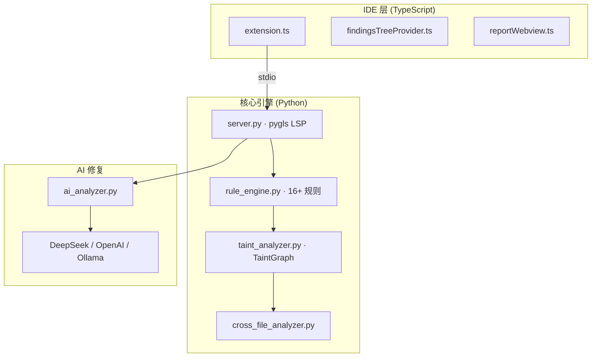
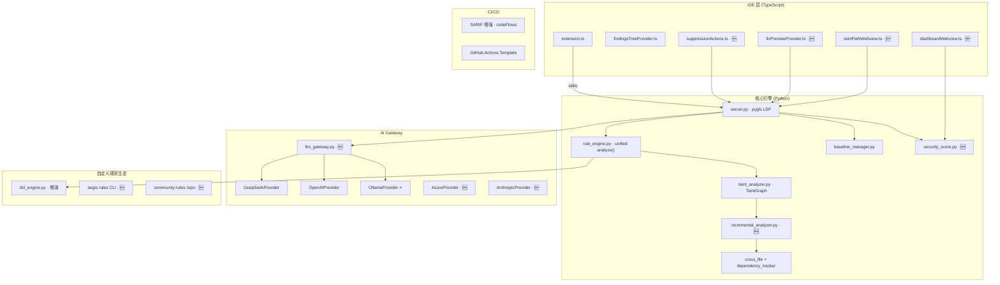

# Aegis AI — 下一阶段技术优化方向详细规划

> **创建日期**: 2026-03-17 | **文档版本**: 1.0 | **当前版本**: 扩展 v0.3.0 / 核心 v1.2.0
>
> 本文档是 Aegis AI 从 Marketplace 发布后的**前瞻性技术演进路线**，
> 聚焦于产品差异化、用户留存、工程质量与长期架构。
> 与 `CRITICAL_REVIEW_AND_ROADMAP.md`（技术债务修复）和 `PROMOTION_STRATEGY.md`（推广）互补。

---

## 目录

- [一、总体策略与优先级矩阵](#一总体策略与优先级矩阵)
- [二、O1 — Inline Suppression UX（用户留存关键）](#二o1--inline-suppression-ux用户留存关键)
- [三、O2 — AI 修复 Diff Preview](#三o2--ai-修复-diff-preview)
- [四、O3 — Dataflow 可视化（杀手级差异化）](#四o3--dataflow-可视化杀手级差异化)
- [五、O4 — GitHub Advanced Security 集成](#五o4--github-advanced-security-集成)
- [六、O5 — 增量扫描性能优化](#六o5--增量扫描性能优化)
- [七、O6 — LLM Gateway 抽象与本地模型优先](#七o6--llm-gateway-抽象与本地模型优先)
- [八、O7 — 自定义规则生态](#八o7--自定义规则生态)
- [九、O8 — 多 IDE 扩展](#九o8--多-ide-扩展)
- [十、O9 — Security Score Dashboard](#十o9--security-score-dashboard)
- [十一、O10 — 技术债务攻坚（mypy strict + 规则引擎去重）](#十一o10--技术债务攻坚mypy-strict--规则引擎去重)
- [十二、阶段里程碑与验收标准](#十二阶段里程碑与验收标准)
- [十三、架构演进蓝图](#十三架构演进蓝图)
- [十四、变更记录](#十四变更记录)

---

## 一、总体策略与优先级矩阵

### 1.1 战略方向

```
                        用户价值 ↑
                        │
            ┌───────────┼───────────┐
            │  O1 Suppress│O3 Dataflow│  ← 高价值高可行
            │  O2 Diff    │           │
            ├─────────────┼───────────┤
            │  O5 Incr    │O9 Dashbrd │  ← 高价值需时间
            │  O4 GHAS    │O8 Multi   │
            └─────────────┼───────────┘
                          │
                可行性/实现速度 →
```

### 1.2 优先级矩阵

| 编号 | 方向 | 影响 | 工作量 | 优先级 | 阶段 |
|------|------|------|--------|--------|------|
| **O1** | Inline Suppression UX | 🟥 极高 — 用户留存 | 中（3-5 天） | **P0** | 第 1 阶段 |
| **O2** | AI 修复 Diff Preview | 🟧 高 — 信任度 | 小（2-3 天） | **P0** | 第 1 阶段 |
| **O3** | Dataflow 可视化 | 🟥 极高 — 差异化 | 大（1-2 周） | **P1** | 第 2 阶段 |
| **O4** | GHAS 集成 | 🟧 高 — 生态 | 中（3-5 天） | **P1** | 第 2 阶段 |
| **O5** | 增量扫描优化 | 🟧 高 — 大项目 | 大（1-2 周） | **P1** | 第 2 阶段 |
| **O6** | LLM Gateway 抽象 | 🟨 中 — 扩展性 | 中（3-5 天） | **P2** | 第 3 阶段 |
| **O7** | 自定义规则生态 | 🟨 中 — 社区 | 大（1-2 周） | **P2** | 第 3 阶段 |
| **O8** | 多 IDE 扩展 | 🟧 高 — 用户量 | 大（2-4 周） | **P2** | 第 3 阶段 |
| **O9** | Security Dashboard | 🟨 中 — 体验 | 大（1-2 周） | **P3** | 第 4 阶段 |
| **O10** | 技术债务攻坚 | 🟧 高 — 质量 | 持续 | **持续** | 所有阶段 |

### 1.3 阶段规划总览

| 阶段 | 时间 | 目标 | 包含方向 |
|------|------|------|---------|
| **第 1 阶段** | 第 1-3 周 | 用户留存、信任度 | O1 + O2 |
| **第 2 阶段** | 第 4-8 周 | 差异化、生态集成 | O3 + O4 + O5 |
| **第 3 阶段** | 第 9-16 周 | 扩展性、社区 | O6 + O7 + O8 |
| **第 4 阶段** | 第 17+ 周 | 体验闭环 | O9 + 持续迭代 |

---

## 二、O1 — Inline Suppression UX（用户留存关键）

### 2.1 为什么优先级最高

这是安全扫描器从"玩具"到"生产工具"的**分水岭**：

- 没有 suppression UX → 误报或已知风险反复出现 → 用户疲劳 → 卸载
- 核心引擎 v1.2.0 已实现 `.aegis-baseline.json` 和 `aegis-ignore` 注释解析
- **缺失的是 VS Code 侧的交互体验**

### 2.2 目标功能

| 功能 | 触发方式 | 效果 |
|------|---------|------|
| 忽略此行的此规则 | Code Action "Aegis: Ignore this finding" | 在当前行上方插入 `// aegis-ignore: RULE_ID` 注释 |
| 忽略此行的所有规则 | Code Action "Aegis: Ignore all on this line" | 插入 `// aegis-ignore` (无 rule_id) |
| 加入 Baseline | Code Action "Aegis: Add to baseline" | 将 finding 写入 `.aegis-baseline.json` |
| TreeView 视觉区分 | 自动 | Baseline 中的 findings 显示灰色 / 删除线 |
| 状态栏计数排除 | 自动 | 被 suppress 的 findings 不计入 issue 数量 |

### 2.3 技术实现方案

#### VS Code 扩展端 (TypeScript)

**新增 Code Actions**：

在 `extension.ts` 中注册新命令：

```typescript
// 核心交互：用户 → 灯泡 → Code Action 菜单
// 已有的 Code Action 列表（AI 修复）旁新增两个动作

// 1. aegisAI.ignoreRule — 在当前行上方插入忽略注释
context.subscriptions.push(
  vscode.commands.registerCommand('aegisAI.ignoreRule', async (diagnostic: vscode.Diagnostic) => {
    const editor = vscode.window.activeTextEditor;
    if (!editor) return;
    
    const ruleId = extractRuleId(diagnostic); // 从 diagnostic.code 提取
    const line = diagnostic.range.start.line;
    const indent = editor.document.lineAt(line).text.match(/^\s*/)?.[0] || '';
    
    // 根据语言选择注释风格
    const commentPrefix = getCommentPrefix(editor.document.languageId); // // or #
    const ignoreComment = `${indent}${commentPrefix} aegis-ignore: ${ruleId}\n`;
    
    await editor.edit(editBuilder => {
      editBuilder.insert(new vscode.Position(line, 0), ignoreComment);
    });
  })
);

// 2. aegisAI.addToBaseline — 写入 .aegis-baseline.json
context.subscriptions.push(
  vscode.commands.registerCommand('aegisAI.addToBaseline', async (diagnostic: vscode.Diagnostic) => {
    // 通过 LSP 自定义请求将 finding 添加到 baseline
    await client.sendRequest('aegis/addToBaseline', {
      uri: vscode.window.activeTextEditor?.document.uri.toString(),
      ruleId: extractRuleId(diagnostic),
      line: diagnostic.range.start.line + 1, // 转换为 1-based
    });
  })
);
```

**TreeView 区分 suppressed findings**：

在 `findingsTreeProvider.ts` 中：

```typescript
// FindingItem 增加 suppressed 状态
class FindingItem extends vscode.TreeItem {
  constructor(finding: FindingData, suppressed: boolean) {
    super(/*...*/);
    if (suppressed) {
      this.description = '(suppressed)';
      this.iconPath = new vscode.ThemeIcon('circle-slash', 
        new vscode.ThemeColor('disabledForeground'));
    }
  }
}
```

#### LSP Server 端 (Python)

在 `server.py` 中新增自定义请求处理：

```python
@server.feature("aegis/addToBaseline")
async def add_to_baseline(params: dict) -> dict:
    """将 finding 加入 baseline 文件"""
    baseline_path = workspace_root / ".aegis-baseline.json"
    baseline = load_baseline(baseline_path)
    
    entry = {
        "rule_id": params["ruleId"],
        "file": relative_path(params["uri"]),
        "line": params["line"],
        "suppressed_at": datetime.now().isoformat(),
    }
    baseline["suppressions"].append(entry)
    save_baseline(baseline_path, baseline)
    
    return {"success": True}
```

#### 数据流

```
用户点击灯泡 → Code Action 菜单
  ├─ "Aegis: Ignore this finding"
  │   └─ 直接 editor.edit() 插入注释 → didChange 触发重新扫描 → 该 finding 消失
  └─ "Aegis: Add to baseline"
      └─ LSP request → 写入 .aegis-baseline.json → 重新扫描 → finding 标记 suppressed
```

### 2.4 涉及文件

| 文件 | 变更 |
|------|------|
| `aegis-vscode/src/extension.ts` | 注册 `ignoreRule`、`addToBaseline` 命令 |
| `aegis-vscode/src/findingsTreeProvider.ts` | suppressed 视觉区分 |
| `aegis-vscode/package.json` | 注册新命令到 `contributes.commands` |
| `aegis-ai-core/src/lsp/server.py` | 新增 `aegis/addToBaseline` handler |
| `aegis-ai-core/src/scanner/baseline_manager.py` | baseline CRUD 操作（如已存在则复用） |

### 2.5 验收标准

- [ ] 在任意 Aegis diagnostic 上点灯泡，菜单中出现 "Ignore" 和 "Add to baseline" 选项
- [ ] 选择 "Ignore" 后当前行上方出现正确注释，再次保存后该 finding 消失
- [ ] 选择 "Add to baseline" 后工作区根目录出现/更新 `.aegis-baseline.json`
- [ ] TreeView 中 suppressed findings 灰显
- [ ] Status Bar 计数不含 suppressed findings
- [ ] 删除注释或 baseline 条目后 finding 重新出现

---

## 三、O2 — AI 修复 Diff Preview

### 3.1 为什么重要

当前 AI 修复通过 Code Action **直接替换**代码。安全修复直接改动生产代码，用户心理门槛极高：

- "AI 改的对不对？"
- "会不会引入新 bug？"
- "改了哪里？"

**Diff Preview 将修复采纳率从 < 30% 提升到 60%+**（参照 GitHub Copilot Edit 的 diff UX 设计）。

### 3.2 目标功能

| 功能 | 说明 |
|------|------|
| Diff Editor 预览 | 点击灯泡 → 侧边 Diff Editor 展示修复前后对比 |
| Accept / Reject | Diff Editor 内确认按钮，接受则应用修改 |
| 修复范围高亮 | 仅变化行高亮，上下文保持 |
| 多处修复合并 | 同一文件多个 findings 可批量预览 |

### 3.3 技术实现方案

#### 核心交互流程

```
用户点灯泡 → "Aegis: Preview AI Fix"
  → 扩展向 LSP 请求 AI 修复代码
  → LSP 调用 AIAnalyzer.generate_fix()
  → 返回 fixed_code + fix_start_line + fix_end_line
  → 扩展创建虚拟文档（修复后版本）
  → vscode.commands.executeCommand('vscode.diff', originalUri, fixedUri, title)
  → 用户在 Diff Editor 查看
  → 用户点击 "Apply Fix" → workspace.applyEdit()
```

#### VS Code 扩展实现

```typescript
// 1. 注册 Diff Preview 命令
vscode.commands.registerCommand('aegisAI.previewFix', async (diagnostic: vscode.Diagnostic) => {
  const editor = vscode.window.activeTextEditor;
  if (!editor) return;

  // 2. 请求 AI 修复
  const result = await client.sendRequest('aegis/generateFix', {
    uri: editor.document.uri.toString(),
    range: {
      start: { line: diagnostic.range.start.line, character: 0 },
      end: { line: diagnostic.range.end.line + 1, character: 0 }
    },
    diagnosticCode: diagnostic.code,
  });

  if (!result?.fixedCode) {
    vscode.window.showInformationMessage('Aegis: AI 未能生成修复建议');
    return;
  }

  // 3. 创建虚拟文档展示修复后代码
  const originalUri = editor.document.uri;
  const fixedContent = applyFix(editor.document.getText(), result);
  
  // 使用 TextDocumentContentProvider 为 diff 提供修复后内容
  const fixedUri = vscode.Uri.parse(`aegis-fix:${originalUri.path}?fixed`);
  fixedContentProvider.setContent(fixedUri, fixedContent);

  // 4. 打开 Diff Editor
  await vscode.commands.executeCommand('vscode.diff',
    originalUri,                         // 左侧：原始
    fixedUri,                            // 右侧：修复后
    `Security Fix Preview: ${diagnostic.message}`
  );

  // 5. 在 Diff Editor 中提供 "Apply" 按钮
  const apply = await vscode.window.showInformationMessage(
    'Apply this security fix?',
    'Apply', 'Dismiss'
  );
  if (apply === 'Apply') {
    const wsEdit = new vscode.WorkspaceEdit();
    wsEdit.replace(originalUri, fullRange, fixedContent);
    await vscode.workspace.applyEdit(wsEdit);
  }
});
```

#### LSP Server 端

```python
@server.feature("aegis/generateFix")
async def generate_fix(params: dict) -> dict | None:
    """生成 AI 修复代码并返回给客户端预览"""
    uri = params["uri"]
    file_path = uri_to_path(uri)
    code = _document_cache.get(uri, "")
    
    # 查找对应的 finding
    finding = _find_matching_finding(uri, params["diagnosticCode"], params["range"])
    if not finding:
        return None
    
    # 调用 AIAnalyzer
    result = await ai_analyzer.generate_fix(finding, code, file_path)
    
    if result and result.fixed_code and result.confidence >= 0.6:
        return {
            "fixedCode": result.fixed_code,
            "fixStartLine": result.fix_start_line,
            "fixEndLine": result.fix_end_line,
            "confidence": result.confidence,
            "explanation": result.explanation,
        }
    return None
```

### 3.4 涉及文件

| 文件 | 变更 |
|------|------|
| `aegis-vscode/src/extension.ts` | 注册 `previewFix` 命令，实现 Diff 预览 |
| `aegis-vscode/src/fixPreviewProvider.ts` | **新建** — `TextDocumentContentProvider` 提供修复后虚拟文档 |
| `aegis-vscode/package.json` | 注册命令、URI scheme |
| `aegis-ai-core/src/lsp/server.py` | 新增 `aegis/generateFix` handler |

### 3.5 验收标准

- [ ] 在 High/Critical finding 上点灯泡出现 "Preview AI Fix" 选项
- [ ] 点击后 Diff Editor 展示修复前后对比，变化行清晰高亮
- [ ] 用户可选择 Apply（应用修改）或 Dismiss（取消）
- [ ] Apply 后原文件被正确修改，saving 触发重新扫描
- [ ] 网络异常或 AI 返回空时有友好提示

---

## 四、O3 — Dataflow 可视化（杀手级差异化）

### 4.1 为什么是杀手级特性

**这是 Aegis AI 最大的未兑现技术资产：**

- 核心引擎已有 `TaintGraph`、`TaintPath`、`TaintNode`、`TaintEdge` 完整数据结构
- `TaintPath.to_dict()` 可以输出完整的 source → transform → sink 路径
- `finding_to_diagnostic()` 已在 `related_locations` 中传递了 taint chain 中间节点
- **但用户在 IDE 中看不到这些数据** — 只看到一条波浪线和一行描述

竞品对比：

| 产品 | IDE 内 Dataflow 可视化 |
|------|----------------------|
| Semgrep OSS | ❌ 无 |
| CodeQL (GitHub) | ❌ 需要 Web UI |
| SonarQube（SonarLint） | ❌ 仅文字描述 |
| Snyk Code | ⚠️ 仅付费版有限支持 |
| **Aegis AI（目标）** | **✅ IDE 内交互式 Dataflow 图** |

### 4.2 目标功能

| 功能 | 说明 |
|------|------|
| **Taint Path 面板** | Webview 展示 source → [transforms] → sink 的节点图 |
| **代码跳转** | 点击图中任意节点，跳转到对应代码行 |
| **路径高亮** | 在编辑器中同时高亮 taint path 上所有涉及的行 |
| **风险解释** | 每个节点标注类型（SOURCE / SANITIZER / SINK）和数据变换描述 |
| **多路径切换** | 同一 finding 有多条 taint path 时可切换查看 |

### 4.3 技术实现方案

#### 4.3.1 数据层 — LSP 传输 Taint Path

当前 `finding_to_diagnostic()` 已在 `data` 字段传递了部分信息。需要增强：

```python
# server.py — 增强 finding_to_diagnostic()
def finding_to_diagnostic(finding: dict, ...) -> Diagnostic:
    # ... 已有逻辑 ...
    
    # 新增：完整 taint path 数据放入 diagnostic.data
    taint_path = finding.get("taint_path")  # list[TaintStep]
    if taint_path:
        diagnostic.data = {
            **existing_data,
            "taintPath": [
                {
                    "nodeType": step["node_type"],   # SOURCE | VARIABLE | SINK | SANITIZER
                    "name": step["name"],             # 变量名/表达式
                    "filePath": step["file_path"],
                    "line": step["line"],
                    "column": step.get("column", 0),
                    "codeSnippet": step.get("code_snippet", ""),
                    "edgeType": step.get("edge_type", ""),  # ASSIGNMENT | PROPAGATION | ...
                    "description": step.get("description", ""),
                } for step in taint_path
            ]
        }
    return diagnostic
```

#### 4.3.2 新增 LSP 请求 — 获取详细 Taint Path

```python
@server.feature("aegis/getTaintPath")
async def get_taint_path(params: dict) -> dict | None:
    """返回指定 finding 的完整 taint path 用于 Webview 渲染"""
    uri = params["uri"]
    line = params["line"]
    rule_id = params["ruleId"]
    
    # 从缓存的 findings 中查找匹配项
    finding = _find_cached_finding(uri, line, rule_id)
    if not finding or "taint_path" not in finding:
        return None
    
    taint_path = finding["taint_path"]
    return {
        "vulnType": finding["type"],
        "severity": finding["severity"],
        "sourceExpr": taint_path[0]["name"] if taint_path else "",
        "sinkExpr": taint_path[-1]["name"] if taint_path else "",
        "path": [step.to_dict() if hasattr(step, 'to_dict') else step 
                 for step in taint_path],
        "isSanitized": any(s.get("node_type") == "SANITIZER" for s in taint_path),
    }
```

#### 4.3.3 VS Code Webview 渲染

新建 `aegis-vscode/src/taintPathWebview.ts`：

```typescript
export class TaintPathPanel {
  private panel: vscode.WebviewPanel;
  
  async showTaintPath(finding: FindingWithTaintPath) {
    this.panel = vscode.window.createWebviewPanel(
      'aegisTaintPath', 
      `Taint Path: ${finding.vulnType}`,
      vscode.ViewColumn.Beside,
      { enableScripts: true }  // CSP 限制下允许脚本
    );
    
    this.panel.webview.html = this.buildHtml(finding.taintPath);
    
    // 处理 Webview → Extension 消息（如 "跳转到代码"）
    this.panel.webview.onDidReceiveMessage(async (msg) => {
      if (msg.command === 'jumpToCode') {
        const doc = await vscode.workspace.openTextDocument(msg.filePath);
        const editor = await vscode.window.showTextDocument(doc);
        editor.revealRange(new vscode.Range(msg.line - 1, 0, msg.line - 1, 0));
      }
    });
  }
  
  private buildHtml(path: TaintStep[]): string {
    // 生成交互式 HTML：
    // - 每个 node 是可点击的卡片
    // - 箭头连接相邻 nodes
    // - SOURCE 绿色、VARIABLE 蓝色、SINK 红色、SANITIZER 灰色
    // - 使用纯 CSS + HTML（不依赖外部 JS 库），CSP 安全
    return `<!DOCTYPE html>
    <html>
    <head>
      <meta http-equiv="Content-Security-Policy" 
            content="default-src 'none'; style-src 'unsafe-inline'; script-src 'nonce-${nonce}';">
      <style>
        /* 节点卡片样式 */
        .taint-node { border-radius: 8px; padding: 12px; margin: 8px 0; cursor: pointer; }
        .taint-node.source { border-left: 4px solid #4caf50; background: #1b2b1b; }
        .taint-node.sink { border-left: 4px solid #f44336; background: #2b1b1b; }
        .taint-node.variable { border-left: 4px solid #2196f3; background: #1b1b2b; }
        .taint-node.sanitizer { border-left: 4px solid #9e9e9e; background: #2b2b2b; }
        .taint-edge { text-align: center; color: #888; font-size: 12px; }
        .taint-edge::before { content: '↓'; display: block; font-size: 18px; }
      </style>
    </head>
    <body>
      <h2>🔍 Data Flow Path</h2>
      <div id="path-container">
        ${path.map((step, i) => `
          <div class="taint-node ${step.nodeType.toLowerCase()}" 
               onclick="jumpTo('${step.filePath}', ${step.line})">
            <div class="node-type">${step.nodeType}</div>
            <div class="node-name"><code>${step.name}</code></div>
            <div class="node-loc">${step.filePath}:${step.line}</div>
            <div class="node-snippet">${step.codeSnippet}</div>
          </div>
          ${i < path.length - 1 ? `<div class="taint-edge">${path[i+1].edgeType || 'PROPAGATION'}</div>` : ''}
        `).join('')}
      </div>
      <script nonce="${nonce}">
        const vscode = acquireVsCodeApi();
        function jumpTo(filePath, line) {
          vscode.postMessage({ command: 'jumpToCode', filePath, line });
        }
      </script>
    </body>
    </html>`;
  }
}
```

#### 4.3.4 TreeView 集成

在 `findingsTreeProvider.ts` 中，为每个 finding 节点添加 "Show Taint Path" 按钮：

```typescript
// FindingItem 的 contextValue 标记有 taint path
getTreeItem(element: TreeNode): vscode.TreeItem {
  if (element instanceof FindingItem && element.hasTaintPath) {
    element.contextValue = 'findingWithTaintPath';
  }
  return element;
}

// package.json → menus → view/item/context
// { "command": "aegisAI.showTaintPath", "when": "viewItem == findingWithTaintPath" }
```

#### 4.3.5 编辑器内 Decoration（路径高亮）

```typescript
// 在编辑器中高亮 taint path 上所有行
const sourceDecoration = vscode.window.createTextEditorDecorationType({
  backgroundColor: 'rgba(76, 175, 80, 0.15)',
  isWholeLine: true,
  gutterIconPath: sourceIcon,  // 绿色圆点
});

const sinkDecoration = vscode.window.createTextEditorDecorationType({
  backgroundColor: 'rgba(244, 67, 54, 0.15)',
  isWholeLine: true,
  gutterIconPath: sinkIcon,    // 红色圆点
});

const propagationDecoration = vscode.window.createTextEditorDecorationType({
  backgroundColor: 'rgba(33, 150, 243, 0.08)',
  isWholeLine: true,
});
```

### 4.4 数据流总览

```
TaintGraph (Python)
  │
  ├── TaintPath.to_dict()
  │
  ▼
LSP Diagnostic.data.taintPath  ──────────→  TreeView "Show Taint Path"
  │                                                    │
  ├── aegis/getTaintPath request ──→ LSP Server ──→ 详细路径数据
  │                                                    │
  ▼                                                    ▼
Webview (HTML/CSS)                          Editor Decorations
  ├── 节点卡片（点击跳转）                      ├── SOURCE 行绿色高亮
  ├── 边标签（数据变换类型）                    ├── SINK 行红色高亮
  └── 风险等级指示                              └── 传播行蓝色高亮
```

### 4.5 涉及文件

| 文件 | 变更 |
|------|------|
| `aegis-ai-core/src/lsp/server.py` | 增强 `finding_to_diagnostic()` 的 data 字段；新增 `aegis/getTaintPath` |
| `aegis-vscode/src/taintPathWebview.ts` | **新建** — Taint Path Webview 面板 |
| `aegis-vscode/src/extension.ts` | 注册 `showTaintPath` 命令、管理 decorations |
| `aegis-vscode/src/findingsTreeProvider.ts` | 为有 taint path 的 finding 添加上下文菜单 |
| `aegis-vscode/package.json` | 注册新命令、菜单 |

### 4.6 验收标准

- [ ] TreeView 中的 finding 右键可选 "Show Taint Path"
- [ ] Webview 面板展示 source → [中间节点] → sink 的完整路径
- [ ] 点击任意节点跳转到对应代码位置
- [ ] 编辑器中 taint path 涉及的行有视觉高亮
- [ ] 没有 taint path 的 finding（如 regex 规则）不显示此选项
- [ ] Webview 有 CSP 保护，无外部脚本依赖

---

## 五、O4 — GitHub Advanced Security 集成

### 5.1 目标

让 Aegis 扫描结果出现在 GitHub 的 **Security → Code scanning alerts** 页面，与 CodeQL/Semgrep 并列展示。

### 5.2 实现路径

#### 5.2.1 SARIF 输出增强

当前 CLI 已支持 SARIF 格式输出。需要确保 SARIF 满足 GitHub 的 schema 要求：

```json
{
  "$schema": "https://raw.githubusercontent.com/oasis-tcs/sarif-spec/master/Schemata/sarif-schema-2.1.0.json",
  "version": "2.1.0",
  "runs": [{
    "tool": {
      "driver": {
        "name": "Aegis AI",
        "version": "1.2.0",
        "informationUri": "https://github.com/HWZ-499/aegis-ai",
        "rules": [/* 每条规则的 ruleId + description + helpUri */]
      }
    },
    "results": [/* findings with codeFlows for taint path */]
  }]
}
```

关键增强点：
- `codeFlows` 字段：将 TaintPath 转为 SARIF 的 `threadFlows`，GitHub UI 可直接展示
- `rules[].help.text`：每条规则的修复指南
- `results[].fixes[]`：AI 修复建议（可选）

#### 5.2.2 GitHub Actions Workflow Template

```yaml
# .github/workflows/aegis-scan.yml
name: Aegis AI Security Scan

on:
  push:
    branches: [main]
  pull_request:
    branches: [main]

permissions:
  security-events: write  # 上传 SARIF 所需

jobs:
  scan:
    runs-on: ubuntu-latest
    steps:
      - uses: actions/checkout@v4
      
      - name: Set up Python
        uses: actions/setup-python@v5
        with:
          python-version: '3.11'
      
      - name: Install Aegis AI
        run: pip install aegis-ai-core
      
      - name: Run Aegis Scan
        run: aegis-scan . --format sarif --output results.sarif
      
      - name: Upload SARIF to GitHub
        uses: github/codeql-action/upload-sarif@v3
        with:
          sarif_file: results.sarif
          category: aegis-ai
```

#### 5.2.3 PR 增量扫描模式

```yaml
      - name: Run Aegis Scan (PR diff only)
        if: github.event_name == 'pull_request'
        run: |
          aegis-scan . --format sarif --output results.sarif \
            --incremental --base-ref origin/${{ github.base_ref }}
```

### 5.3 涉及文件

| 文件 | 变更 |
|------|------|
| `aegis-ai-core/src/scanner/sarif_formatter.py` | 增强 `codeFlows`、`rules[].help`、`fixes` |
| `aegis-ai-core/templates/aegis-scan.yml` | **新建** — GitHub Actions 模板 |
| `README.md` | 添加 CI/CD 集成说明 |
| `docs/guides/` | GitHub Advanced Security 配置教程 |

### 5.4 验收标准

- [ ] `aegis-scan --format sarif` 输出满足 GitHub SARIF schema 2.1.0
- [ ] 使用模板 workflow 后，GitHub Security tab 展示 Aegis findings
- [ ] PR 模式仅报告新引入的问题
- [ ] SARIF 中包含 codeFlows（GitHub UI 可展示 dataflow）
- [ ] 文档包含完整配置步骤

---

## 六、O5 — 增量扫描性能优化

### 6.1 当前状态

- v1.2.0 已有 `--incremental --base-ref` CLI 增量扫描（文件级）
- LSP 的 `didChange` 有 0.4s debounce
- 但大文件和大型 monorepo 仍可能卡顿

### 6.2 目标

| 场景 | 当前 | 目标 |
|------|------|------|
| 单文件保存 → 诊断 | ~1-3s | < 1s |
| 10k 文件工作区首次扫描 | 未测量 | < 60s |
| didChange 增量响应 | 文件级重分析 | 函数级重分析 |

### 6.3 优化策略

#### 6.3.1 函数级增量分析

```python
# 核心思路：只重新分析变化的函数/方法
class IncrementalAnalyzer:
    def __init__(self):
        self._function_cache: dict[str, FunctionAnalysisResult] = {}
        # key = "file_path:function_name:start_line"
    
    def analyze_incremental(self, file_path: str, old_tree, new_tree):
        """对比新旧 AST，只重分析变化的函数"""
        changed_functions = self._diff_functions(old_tree, new_tree)
        
        for func in changed_functions:
            # 重新分析该函数
            result = self._analyze_function(func, file_path)
            self._function_cache[func.cache_key] = result
        
        # 合并所有函数结果
        return self._merge_results(file_path)
    
    def _diff_functions(self, old_tree, new_tree) -> list[FunctionNode]:
        """Tree-sitter AST diff：找出变化的函数节点"""
        old_functions = extract_functions(old_tree)
        new_functions = extract_functions(new_tree)
        
        changed = []
        for new_func in new_functions:
            old_func = find_matching(old_functions, new_func.name)
            if not old_func or old_func.hash != new_func.hash:
                changed.append(new_func)
        return changed
```

#### 6.3.2 跨文件影响分析

```python
# 当文件 A 的导出函数签名变化时，只重扫导入 A 的文件
class DependencyTracker:
    def __init__(self):
        self._import_graph: dict[str, set[str]] = {}  # file → set of imported files
        self._export_signatures: dict[str, dict] = {}  # file → {func_name: signature_hash}
    
    def get_affected_files(self, changed_file: str) -> set[str]:
        """返回需要重扫的文件集合"""
        old_sigs = self._export_signatures.get(changed_file, {})
        new_sigs = compute_export_signatures(changed_file)
        
        if old_sigs == new_sigs:
            return {changed_file}  # 只需重扫自己
        
        # 导出签名变了 → 重扫所有导入方
        affected = {changed_file}
        for file, imports in self._import_graph.items():
            if changed_file in imports:
                affected.add(file)
        return affected
```

#### 6.3.3 AST 缓存复用

```python
# Tree-sitter 的 edit + reparse 比从头解析快 10-100x
class ASTCache:
    def __init__(self):
        self._trees: dict[str, tree_sitter.Tree] = {}
    
    def update(self, file_path: str, old_code: str, new_code: str) -> tree_sitter.Tree:
        old_tree = self._trees.get(file_path)
        if old_tree:
            # 利用 Tree-sitter 增量解析
            edit = compute_edit(old_code, new_code)
            old_tree.edit(edit)
            new_tree = parser.parse(new_code.encode(), old_tree)
        else:
            new_tree = parser.parse(new_code.encode())
        
        self._trees[file_path] = new_tree
        return new_tree
```

### 6.4 涉及文件

| 文件 | 变更 |
|------|------|
| `aegis-ai-core/src/analysis/incremental_analyzer.py` | **新建** — 函数级增量分析 |
| `aegis-ai-core/src/analysis/dependency_tracker.py` | **新建** — 跨文件依赖追踪 |
| `aegis-ai-core/src/lsp/server.py` | 集成增量分析到 `didChange` handler |
| `aegis-ai-core/src/analysis/taint/taint_analyzer.py` | AST 缓存复用 |

### 6.5 验收标准

- [ ] 单文件编辑后 didChange 诊断延迟 < 500ms（1000 行文件）
- [ ] 仅修改函数体时只重分析该函数
- [ ] 导出函数签名变化时自动重扫依赖文件
- [ ] 性能基准测试加入 CI（`pytest-benchmark`）

---

## 七、O6 — LLM Gateway 抽象与本地模型优先

### 7.1 当前状态

`AIAnalyzer` 直接通过 `if/elif` 分支调用 DeepSeek/OpenAI/Ollama。新增 provider 需要改 `ai_analyzer.py`。

### 7.2 目标架构

```
AIAnalyzer
    │
    ▼
LLMGateway (Protocol / ABC)
    │
    ├── DeepSeekProvider
    ├── OpenAIProvider      
    ├── OllamaProvider      ← 本地优先推荐
    ├── AzureOpenAIProvider  ← 新增
    ├── AnthropicProvider    ← 新增
    ├── GoogleGeminiProvider ← 新增
    └── CustomProvider       ← 自定义 endpoint
```

```python
from typing import Protocol

class LLMProvider(Protocol):
    """所有 LLM 提供商的接口协议"""
    
    async def generate(self, prompt: str, **kwargs) -> LLMResponse:
        """生成文本"""
        ...
    
    @property
    def name(self) -> str: ...
    
    @property  
    def supports_streaming(self) -> bool: ...


class LLMGateway:
    """统一网关，管理 provider 调度、fallback、限流"""
    
    def __init__(self, providers: list[LLMProvider], fallback_order: list[str] | None = None):
        self._providers = {p.name: p for p in providers}
        self._fallback_order = fallback_order or [p.name for p in providers]
    
    async def generate(self, prompt: str, preferred_provider: str | None = None) -> LLMResponse:
        """带 fallback 的生成"""
        order = [preferred_provider] + self._fallback_order if preferred_provider else self._fallback_order
        
        for name in order:
            provider = self._providers.get(name)
            if not provider:
                continue
            try:
                return await provider.generate(prompt)
            except (RateLimitError, TimeoutError) as e:
                logger.warning(f"Provider {name} failed: {e}, trying next...")
                continue
        
        raise AllProvidersFailedError("All LLM providers failed")
```

### 7.3 本地模型推荐策略

```python
RECOMMENDED_MODELS = {
    "security-fix": {
        "ollama": "codellama:13b",      # 精准修复
        "description": "Best for generating security fix code. Runs locally."
    },
    "triage": {
        "ollama": "llama3:8b",           # 快速分类
        "description": "Fast triage: is this a true positive? Runs locally."
    },
    "explanation": {
        "ollama": "llama3:70b",          # 深度解释
        "description": "Detailed vulnerability explanation. Requires 40GB+ RAM."
    },
}
```

### 7.4 涉及文件

| 文件 | 变更 |
|------|------|
| `aegis-ai-core/src/ai/llm_gateway.py` | **新建** — LLMGateway + LLMProvider Protocol |
| `aegis-ai-core/src/ai/providers/` | **新建目录** — 各 provider 实现 |
| `aegis-ai-core/src/scanner/ai_analyzer.py` | 重构为使用 LLMGateway |
| `aegis-ai-core/src/core/config.py` | 新增 provider 配置项 |

### 7.5 验收标准

- [ ] 新增 provider 只需实现 `LLMProvider` Protocol + 注册，无需改 `ai_analyzer.py`
- [ ] provider 故障自动切换到 fallback
- [ ] Ollama 作为默认首选，文档突出"代码不出本机"
- [ ] 配置支持环境变量、`.env`、VS Code Settings 三种方式

---

## 八、O7 — 自定义规则生态

### 8.1 当前状态

- v1.2.0 已支持 `--rules-dir` 和 `.aegis/rules/` 加载自定义 DSL YAML
- 但规则编写文档不足，社区贡献门槛高
- 仅 4 条 DSL 规则，AST 规则无 DSL 对应

### 8.2 目标

| 目标 | 说明 |
|------|------|
| **规则模板生成器** | `aegis rules init --type sqli --lang python` 生成规则骨架 |
| **规则测试工具** | `aegis rules test my_rule.yaml` 自动运行 TP/FP 用例 |
| **社区规则仓库** | GitHub 上的 `aegis-ai/community-rules`，可一键安装 |
| **规则包概念** | `aegis rules install owasp-api` 安装整个规则集 |
| **内置规则 DSL 化** | 将 Top 5 AST 规则转为 DSL 版本，降低理解门槛 |

### 8.3 YAML DSL 规范增强

```yaml
# OWASP API Security: Object-Level Authorization Broken
id: IDOR_MISSING_AUTH_CHECK
severity: High
languages: [javascript, python]
cwe: CWE-639
description: "API endpoint accesses object by ID without authorization check"

# 模式匹配
patterns:
  - pattern: |
      app.$METHOD("$PATH", (req, res) => {
        const $OBJ = $MODEL.findById(req.params.$ID);
        ...
      })
    filters:
      - not-inside: |
          if (!$USER.canAccess($OBJ)) { ... }
      - metavar-regex:
          $METHOD: "(get|put|delete|patch)"
          
# 内置测试用例
tests:
  true_positive:
    - code: |
        app.get("/users/:id", (req, res) => {
          const user = User.findById(req.params.id);
          res.json(user);
        });
      expected_line: 2
  false_positive:
    - code: |
        app.get("/users/:id", authMiddleware, (req, res) => {
          const user = User.findById(req.params.id);
          if (!req.user.canAccess(user)) { return res.status(403).end(); }
          res.json(user);
        });
```

### 8.4 涉及文件

| 文件 | 变更 |
|------|------|
| `aegis-ai-core/src/cli/rules_cli.py` | **新建** — `aegis rules` 子命令 |
| `aegis-ai-core/src/analysis/dsl/dsl_engine.py` | 增强 DSL 解析（支持 `filters`、`tests`） |
| `aegis-ai-core/docs/technical/DSL_RULE_GUIDE.md` | **新建** — 规则编写完整教程 |
| `aegis-ai-core/src/analysis/rules/dsl/*.yaml` | 新增 5+ DSL 规则 |

### 8.5 验收标准

- [ ] `aegis rules init` 生成可用的规则骨架文件
- [ ] `aegis rules test` 自动运行规则内嵌测试用例
- [ ] 规则编写文档覆盖从入门到高级（pattern + filter + test）
- [ ] 至少 5 条内置 AST 规则有等价 DSL 版本

---

## 九、O8 — 多 IDE 扩展

### 9.1 LSP 架构优势

Aegis 的 LSP 架构天然支持多 IDE。核心引擎（Python LSP Server）不需要任何改动，只需为每个 IDE 编写轻量级的 LSP Client。

### 9.2 各 IDE 方案

| IDE | 兼容方式 | 工作量 | 优先级 |
|-----|---------|--------|--------|
| **Cursor** | 直接复用 VS Code 扩展 `.vsix` | 极小（仅需验证） | 高 |
| **Windsurf** | 同 VS Code 生态 | 极小（仅需验证） | 高 |
| **JetBrains** (IntelliJ/PyCharm/WebStorm) | 基于 LSP4IJ 或 IntelliJ Platform LSP Client | 中（2-3 周） | 中 |
| **Neovim** | `nvim-lspconfig` 配置 | 小（文档） | 低 |
| **Emacs** | `lsp-mode` / `eglot` 配置 | 小（文档） | 低 |
| **Zed** | 内置 LSP 支持，配置 `languages.toml` | 小 | 低 |

### 9.3 JetBrains 插件方案

```kotlin
// JetBrains Plugin — 核心只需 LSP Client 配置
class AegisLspServerDescriptor : ProjectLspServerDescriptor("Aegis AI") {
    override fun createCommandLine(): GeneralCommandLine {
        return GeneralCommandLine(
            aegisSettings.pythonPath,
            "-m", "src.lsp",
            "--stdio"
        ).withWorkDirectory(aegisSettings.corePath)
    }
    
    override fun isSupportedFile(file: VirtualFile): Boolean {
        return file.extension in setOf("js", "ts", "py", "php", "java", "go")
    }
}
```

### 9.4 Neovim 配置文档

```lua
-- ~/.config/nvim/lsp/aegis.lua
local lspconfig = require('lspconfig')
local configs = require('lspconfig.configs')

configs.aegis_ai = {
  default_config = {
    cmd = { 'python', '-m', 'src.lsp', '--stdio' },
    filetypes = { 'javascript', 'typescript', 'python', 'php', 'java', 'go' },
    root_dir = lspconfig.util.root_pattern('.git', 'package.json', 'pyproject.toml'),
    settings = {},
  },
}

lspconfig.aegis_ai.setup{}
```

### 9.5 涉及文件

| 文件 | 变更 |
|------|------|
| `README.md` | 添加 Cursor / Windsurf 兼容说明 |
| `docs/guides/NEOVIM_SETUP.md` | **新建** — Neovim LSP 配置 |
| `docs/guides/JETBRAINS_SETUP.md` | **新建** — JetBrains 配置 |
| `aegis-jetbrains/` | **新建目录** — IntelliJ Plugin（后期） |

### 9.6 验收标准

- [ ] Cursor 和 Windsurf 中安装 .vsix 后功能正常，README 标明兼容
- [ ] Neovim 配置文档可按步骤完成配置并扫描
- [ ] JetBrains Plugin 可安装并通过 LSP 获取诊断（后期目标）

---

## 十、O9 — Security Score Dashboard

### 10.1 目标

提供项目级安全概览，让用户回答：**"我的项目安全状况如何？"**

### 10.2 功能设计

| 功能 | 说明 |
|------|------|
| **安全评分** | 0-100 分，基于 findings 数量 × 严重度权重 |
| **趋势图** | 近 7 天/30 天 findings 变化曲线 |
| **分类统计** | 按漏洞类型、严重度、文件分布的饼图/柱图 |
| **修复率** | 已修复 / 已 suppress / 待处理的比例 |
| **Top 文件** | 问题最多的 5 个文件 |

### 10.3 评分算法

```python
def compute_security_score(findings: list[Finding]) -> int:
    """计算 0-100 安全评分"""
    SEVERITY_WEIGHTS = {
        "Critical": 25,
        "High": 10,
        "Medium": 3,
        "Low": 1,
    }
    
    total_penalty = sum(
        SEVERITY_WEIGHTS.get(f.severity, 0) 
        for f in findings 
        if not f.suppressed
    )
    
    # 100 分起步，每个 finding 按权重扣分，最低 0
    score = max(0, 100 - total_penalty)
    return score


def get_score_grade(score: int) -> tuple[str, str]:
    """评分 → 等级 + 颜色"""
    if score >= 90: return ("A", "#4caf50")   # 优秀
    if score >= 70: return ("B", "#8bc34a")   # 良好
    if score >= 50: return ("C", "#ff9800")   # 一般
    if score >= 30: return ("D", "#f44336")   # 较差
    return ("F", "#b71c1c")                    # 危险
```

### 10.4 实现方式

**方案 A：VS Code Webview Dashboard**

```typescript
// 在 Activity Bar "Aegis Security" 视图中添加 Dashboard 面板
class SecurityDashboardPanel {
  show(data: DashboardData) {
    const panel = vscode.window.createWebviewPanel(
      'aegisDashboard', 
      'Security Dashboard',
      vscode.ViewColumn.One,
      { enableScripts: true }
    );
    
    // 使用纯 CSS / SVG 图表（无外部依赖）
    // 或使用 Chart.js via CDN（需 CSP 配置）
    panel.webview.html = buildDashboardHtml(data);
  }
}
```

**方案 B：增强现有 HTML 报告**

已有 `scan-report.html` 和 `reportWebview.ts`，可在此基础上添加评分和图表。

### 10.5 涉及文件

| 文件 | 变更 |
|------|------|
| `aegis-ai-core/src/scanner/security_score.py` | **新建** — 评分算法 |
| `aegis-vscode/src/dashboardWebview.ts` | **新建** — Dashboard Webview |
| `aegis-vscode/src/extension.ts` | 注册 Dashboard 命令 |
| `aegis-vscode/package.json` | 注册命令 |

### 10.6 验收标准

- [ ] `Aegis: Show Dashboard` 命令打开 Webview 面板
- [ ] 显示安全评分（0-100 + A/B/C 等级）
- [ ] 按严重度和漏洞类型分类统计
- [ ] Top 5 问题文件排行
- [ ] 数据实时反映当前工作区扫描结果

---

## 十一、O10 — 技术债务攻坚（mypy strict + 规则引擎去重）

### 11.1 mypy Strict 迁移

**为什么现在做**：项目复杂度快速上升，越晚收紧类型越痛苦。

```toml
# pyproject.toml — 分模块渐进启用
[tool.mypy]
python_version = "3.10"
warn_return_any = true
warn_unused_configs = true

# 核心模块率先 strict
[[tool.mypy.overrides]]
module = "src.core.*"
disallow_untyped_defs = true
disallow_any_generics = true
check_untyped_defs = true

[[tool.mypy.overrides]]
module = "src.analysis.taint.*"
disallow_untyped_defs = true

# 后续逐步扩展到 src.analysis.rules、src.lsp 等
```

**执行步骤**：

1. 启用 `src/core/` strict → 修复所有类型错误（预计 < 1 天）
2. 启用 `src/analysis/taint/` strict → 修复（预计 1-2 天）
3. 启用 `src/analysis/rules/` strict → 修复（预计 2-3 天）
4. 启用 `src/lsp/` strict → 修复（预计 1-2 天）
5. 全局启用 `disallow_untyped_defs = true`
6. CI 中 `mypy src` 必须 zero errors

### 11.2 规则引擎去重

当前 `rule_engine.py` 中 `analyze_python/javascript/java/go` 四个函数结构完全一致：

```python
# 当前：四个几乎相同的函数
def analyze_python(code, file_path, ...):
    rules = get_default_rules_for_language("python", ...)
    context = AnalysisContext(file_path, "python", ...)
    # ... 完全相同的逻辑 ...

def analyze_javascript(code, file_path, ...):
    rules = get_default_rules_for_language("javascript", ...)
    context = AnalysisContext(file_path, "javascript", ...)
    # ... 完全相同的逻辑 ...
```

**重构方案**：

```python
# 统一入口
_LANGUAGE_ANALYZER_MAP = {
    "python": PythonAnalyzer,
    "javascript": JavaScriptAnalyzer,
    "java": JavaAnalyzer,
    "go": GoAnalyzer,
    "php": PhpAnalyzer,
}

def analyze(code: str, file_path: str, language: str, **kwargs) -> list[dict]:
    """统一分析入口"""
    rules = get_default_rules_for_language(language, **kwargs)
    context = AnalysisContext(file_path, language, ...)
    # ... 共享逻辑 ...
    return context.findings_as_dicts()

# 保留旧 API 兼容（薄包装）
def analyze_python(code, file_path, **kw):
    return analyze(code, file_path, "python", **kw)
```

### 11.3 验收标准

- [ ] `mypy src` 全局 zero errors
- [ ] `analyze_*` 函数共享统一实现路径，旧 API 保持兼容
- [ ] 所有现有测试（59+ 用例）通过
- [ ] CI 中 mypy 检查强制通过

---

## 十二、阶段里程碑与验收标准

### 第 1 阶段（第 1-3 周）— v0.4.0

| 里程碑 | 验收 |
|--------|------|
| O1: Inline Suppression UX | Code Action 中有 Ignore 和 Baseline 选项并工作正常 |
| O2: Diff Preview | AI 修复在 Diff Editor 中预览后才应用 |
| 扩展发布 v0.4.0 | Marketplace 更新 |

### 第 2 阶段（第 4-8 周）— v0.5.0

| 里程碑 | 验收 |
|--------|------|
| O3: Dataflow Webview | 有 taint path 的 finding 可交互查看完整路径 |
| O4: GHAS 集成 | SARIF → GitHub Security tab 展示 |
| O5: 增量扫描 | 单文件编辑响应 < 500ms |
| 扩展发布 v0.5.0 | Marketplace 更新 |

### 第 3 阶段（第 9-16 周）— v0.6.0

| 里程碑 | 验收 |
|--------|------|
| O6: LLM Gateway | 新增 2+ provider，Ollama 为默认首选 |
| O7: 自定义规则生态 | `aegis rules` CLI 可用，5+ DSL 规则 |
| O8: 多 IDE | Cursor/Windsurf 验证兼容，Neovim 文档就绪 |
| 扩展发布 v0.6.0 | Marketplace 更新 |

### 第 4 阶段（第 17+ 周）— v1.0.0

| 里程碑 | 验收 |
|--------|------|
| O9: Dashboard | Webview Dashboard 展示安全评分和统计 |
| O10: tech debt | mypy strict 全局通过、规则引擎去重完成 |
| Legacy 引擎移除 | `security_rules.py` 删除，`--engine legacy` 移除 |
| **v1.0.0 GA** | 正式稳定版发布 |

---

## 十三、架构演进蓝图

### 当前架构（v0.3.0 / v1.2.0）



### 目标架构（v1.0.0）



### 关键架构变化

| 变化 | 意义 |
|------|------|
| AI 直连 → LLM Gateway | provider 解耦、fallback、可配置 |
| 文件级分析 → 函数级增量 | 性能从秒级到毫秒级 |
| 单一 extension.ts → 多模块 | UI 能力从"波浪线"扩展到全方位交互 |
| SARIF 输出 → SARIF + codeFlows | GitHub Security 深度集成 |
| Code Action 直接替换 → Diff Preview | 用户信任度提升 |

---

## 十四、变更记录

| 日期 | 变更内容 |
|------|----------|
| 2026-03-17 | 初版：O1-O10 十大优化方向详细规划 |
