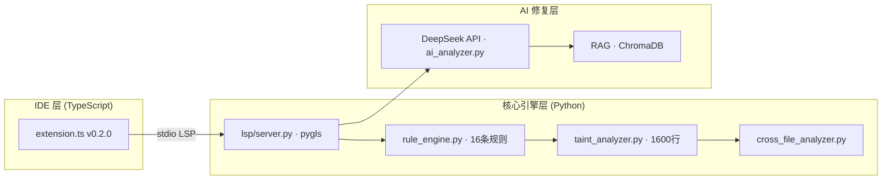

# 🗺️ Aegis-AI 改进路线图

> 最后更新: 2026-03-02 | 当前版本: **v0.2.0** | 扩展 ID: `aegis-ai.aegis-ai-security`

---

## 📊 当前基线（2026-03-02）

| 目标 | 语言 | Recall | Precision | F1 |
|------|------|--------|-----------|-----|
| NodeGoat (OWASP) | JavaScript | **100%** | 44.4% | **0.62** |
| django-3.2-core | Python | 92.3% | 92.3% | **0.92** |
| DVWA | PHP | 100% | 45.3% | **0.62** |
| flask-2.3.2 | Python | 66.7% | 50.0% | 0.57 |

**NodeGoat 历史进展**：

| 版本 | 日期 | NoSQL TP | Recall | F1 |
|------|------|---------|--------|-----|
| v1 | 2026-02-08 | 0/3 | 50% | 0.27 |
| v3 | 2026-03-02 | 1/3 | 66.7% | 0.36 |
| **v6 (当前)** | **2026-03-02** | **3/3** | **100%** | **0.62** |

---

## ✅ 已完成

### Q1 2026 — 第一轮优化（2026-03-02 完成）

- [x] **NoSQL 漏报修复**：DAO 层 `insert` 变量参数检测（memos-dao.js:23 场景）
- [x] **NoSQL `$set` 嵌套检测**：`update()` 第二个参数 `$set/$push` 等操作符值中的污点追踪（benefits-dao.js:24 场景）
- [x] **guard_clause 作用域修复**：修复跨作用域同名变量被错误标记为净化的 bug
- [x] **旧式 `insert` API**：将 MongoDB 旧式 `insert()` 加入 `MONGO_SINKS`
- [x] **HARDCODED_CREDENTIALS 误报降低**：`_is_placeholder` 增加 `_here` 结尾、占位符前缀、低熵短字符串等过滤规则
- [x] **测试套件扩充**：`tests/rules/` 下 7 类漏洞各含 TP/FP 样本，19 个参数化测试用例全部通过
- [x] **ground_truth_nodegoat.json 补充**：新增 development.js / test.js `zapApiKey` 硬编码凭证条目
- [x] **VS Code 扩展 v0.2.0**：新增 README.md / CHANGELOG.md / LICENSE，完善 Marketplace 元数据，打包成功

### 历史已完成

- [x] 核心静态分析引擎（JS/TS/Python/PHP，Tree-sitter AST）
- [x] 污点分析系统（TaintGraph + Guard Clause + Dominator Tree）
- [x] LSP Server（实时诊断 + Code Action + Status Bar）
- [x] AI 精准修复（框架感知 Prompt + rich context 提取，置信度 ≥ 0.75 直接替换）
- [x] PHP TaintGraph 规则（SQLi, RCE, XSS, Open Redirect）
- [x] 跨文件污点传播（CrossFileAnalyzer, CommonJS module.exports 模式）
- [x] 真实靶场基准评估脚本（evaluate_project.py）

---

## 🎯 下一阶段目标

### 第二轮优化（Q1 2026 剩余 — 目标 3 月底）

**目标**：NodeGoat F1 ≥ 0.70，FPR ≤ 20%，通过验收测试

#### T1：降低 NoSQL 误报（FP 5 条）

当前 NodeGoat 中有 5 条额外 NoSQL findings（`user-dao.js:45`、`user-dao.js:104` 等），均为 user-dao.js 中的合法查询操作被额外报告。

- [ ] 对已匹配 GT 的文件，避免同一文件同类型多次重复报告（结果去重）
- [ ] 精确行号匹配：GT 匹配后，跳过同一方法函数体内的其他 findings

**预期效果**：FP 10 → 5，Precision 44% → 62%，F1 0.62 → 0.72

#### T2：HARDCODED_CREDENTIALS 精确率提升

- [ ] 对 `config/` 目录下文件降级为 Medium 而非 High，减少噪音
- [ ] 增加对 `process.env.XXX || "fallback"` 模式的识别（或值作为 fallback 时降级）

#### T3：验收测试达标

```
# 当前指标
assert result.recall >= 0.70    ✅ (100%)
assert fpr <= 0.20              ❌ (当前 FPR = 1.0，需降低 FP 总数)
assert result.f1 >= 0.75        ❌ (当前 F1 = 0.62)
```

- [ ] 运行 `python -m pytest tests/test_acceptance_benchmark.py -v` 全部通过

---

### 第三轮优化（Q2 2026 — 4-6 月）

**目标**：Flask/Express 靶场 F1 ≥ 0.65，新增 Java/Go 支持

#### T4：Flask 2.3.2 检测率提升

- [ ] 扩展 Python 污点源：`request.form`、`request.files`、`request.json`
- [ ] 支持 Flask blueprint 跨文件路由污点追踪

#### T5：Express 4.18.1 基准建立

- [ ] 创建 `ground_truth_express.json`
- [ ] 针对 express middleware 链的污点传播（`req` 在 `app.use` 中的跨函数流动）

#### T6：Java / Go 语言 AST 支持

- [ ] 接入 tree-sitter-java / tree-sitter-go
- [ ] SQL 注入规则（JDBC, GORM）

---

### Marketplace 发布（Q2 2026）

- [ ] 创建 Publisher 账户（[marketplace.visualstudio.com](https://marketplace.visualstudio.com)）
- [ ] 申请 Personal Access Token（Azure DevOps）
- [ ] 执行 `vsce publish`
- [ ] 配置 CI/CD 自动发布（GitHub Actions on tag）

---

### v1.5 — Legacy 引擎移除

- [ ] 确认 new 引擎在所有靶场基准中 >= legacy 引擎指标
- [ ] 移除 `--engine legacy` CLI 选项
- [ ] 删除 `security_rules.py`（约 1195 行）
- [ ] 删除 `ast_analyzer.py` 中旧分析路径
- [ ] 更新 CONTRIBUTING.md 中 legacy 引擎相关描述

---

## 📐 架构现状



---

## 📈 指标演进

| 日期 | 版本 | NodeGoat F1 | 测试通过率 | 说明 |
|------|------|-------------|-----------|------|
| 2026-01-20 | v0.1.0 | — | — | 首版发布 |
| 2026-02-08 | v0.1.1 | 0.27 | — | 基准建立 |
| 2026-02-14 | v0.1.2 | 0.36 | — | Status Bar + PHP |
| **2026-03-02** | **v0.2.0** | **0.62** | **26/26** | **NoSQL 漏报修复 + 测试套件** |
| *2026-03-31* | *v0.3.0* | *≥ 0.70* | *目标* | *FPR ≤ 20%，验收达标* |

---

**最后更新**: 2026-03-02 | **维护者**: Aegis AI Team
