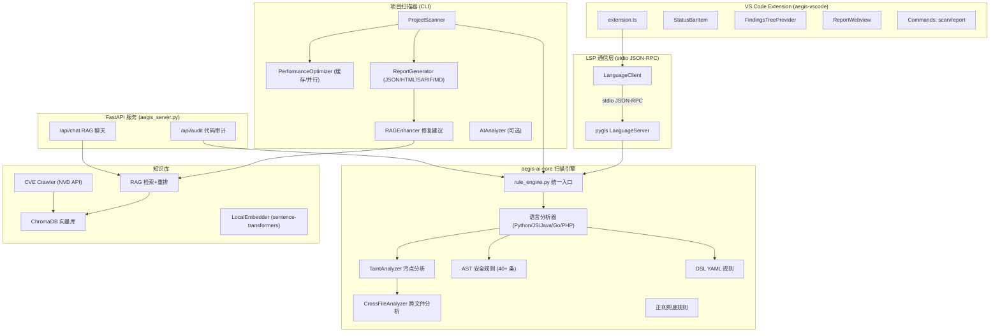
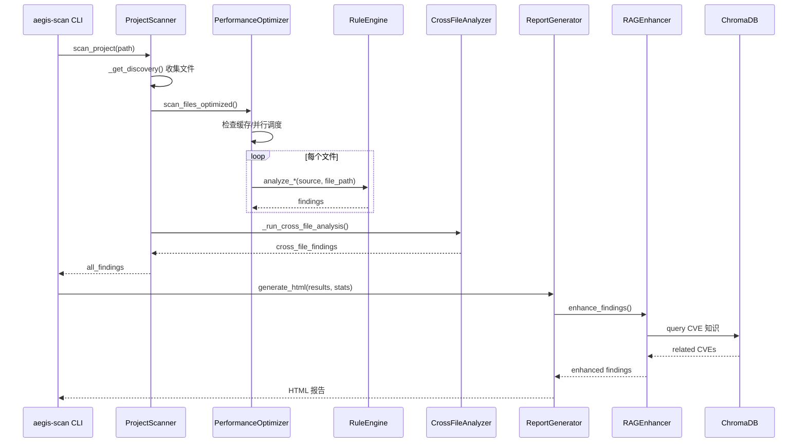

# Aegis-AI 项目全面技术文档

## 一、项目概述

Aegis-AI 是一个 **Local-first 静态应用安全测试 (SAST) 平台**，由两大核心组件构成：

- **aegis-ai-core**（Python 后端）：本地 SAST 扫描引擎，包含 AST 分析、污点追踪、规则引擎、RAG 增强、CVE 知识库与 API/LSP 服务。
- **aegis-vscode**（TypeScript 前端）：VS Code 扩展，通过 LSP 协议与后端通信，在 IDE 内实时展示安全漏洞并提供安全开发辅助。

### 1.1 项目定位

- 面向安全运维 / 安全工程 / DevSecOps 场景，用于：
  - 本地代码安全自查（开发者在 IDE / 本地 CLI 中使用）。
  - CI/CD 流水线中的安全卡点（以 CLI + SARIF 报告形式接入）。
  - 安全运营平台的审计后端（通过 FastAPI 对外提供审计能力）。
- 强调 **不上传源代码到云端**，在本机完成 AST 解析与静态分析，降低敏感代码泄露风险。

### 1.2 技术栈总览

| 层级           | 技术                                                                 |
|----------------|----------------------------------------------------------------------|
| 扫描引擎       | Python 3.10+，tree-sitter（多语言 AST 解析），自定义规则引擎        |
| 污点分析       | 自研 TaintGraph + Source/Sink/Sanitizer 注册表                      |
| 知识库 / RAG   | ChromaDB（向量数据库）+ NVD API 2.0 CVE 爬虫 + RAG 重排优化         |
| AI 增强        | DeepSeek / OpenAI API + RAG（检索增强生成）                         |
| API 服务       | FastAPI + uvicorn                                                    |
| IDE 集成       | pygls（LSP Server）+ vscode-languageclient                           |
| 前端扩展       | TypeScript，VS Code Extension API                                   |

---

## 二、整体架构



---

## 三、核心模块详解（aegis-ai-core）

### 3.1 规则引擎（`aegis-ai-core/src/analysis/rule_engine.py`）

统一入口，暴露：

- `analyze_python()`
- `analyze_javascript()`
- `analyze_php()`
- `analyze_java()`
- `analyze_go()`

供：

- `ProjectScanner`（CLI 项目扫描器）
- LSP Server（`src/lsp/server.py`）
- FastAPI 服务（`src/server/aegis_server.py`）

三者统一调用。

**工作流程：**

1. `get_default_rules_for_language(lang)` 获取该语言的默认规则集合（AST 规则 + DSL 规则）。
2. 按语言创建对应的 Analyzer（如 `PythonAnalyzer`、`JavaScriptAnalyzer`）。
3. 分析器内部流程：
   - 使用 tree-sitter 解析源码为 AST；
   - 调用 `TaintAnalyzer` 对源码构建污点图；
   - 遍历 AST 节点，依次调用每条规则的 `visit(node, context)`；
   - 规则在 `visit` 或 `after_file` 阶段将发现的漏洞以统一格式写入 `AnalysisContext`。

**已注册规则（8 类漏洞 x 多语言）：**

- SQL 注入 / NoSQL 注入 / RCE / XSS / 路径遍历 / 硬编码凭证 / 反序列化 / 开放重定向。
- 支持语言：Python、JavaScript/TypeScript、Java、Go、PHP。

### 3.2 AST 解析与安全规则

**AST 解析器：**

- 基于 tree-sitter（C 实现的增量解析器），通过 `tree_sitter_languages.get_language` 加载各语言语法；
- 支持不完整代码、容错解析，适合 IDE 场景下的增量扫描。

**规则基类： `src/analysis/base/security_rule.py`**

```python
class SecurityRule(ABC):
    def supports(self, language: str) -> bool
    def visit(self, node: Any, context: AnalysisContext) -> None  # 核心：访问每个 AST 节点
    def before_file(self, context: AnalysisContext) -> None
    def after_file(self, context: AnalysisContext) -> None
```

每条具体规则只需要关心：

- 适用语言；
- 哪些 AST 模式代表潜在漏洞；
- 如何将发现转换成统一结构的 finding。

**SQL 注入检测原理示例：**

- 检测：`cursor.execute("SELECT * FROM users WHERE id=" + user_input)`
  - 模式：字符串字面量 + 变量拼接；
  - 若变量来自用户输入源（由 `TaintAnalyzer` 标记），则报告 SQL 注入。
- 检测：`cursor.execute(f"SELECT * FROM users WHERE id={user_input}")`
  - 模式：f-string 中直接插入未净化变量；
  - 若变量被标记为污点，则报告。
- 豁免安全写法：
  - `cursor.execute("SELECT * FROM users WHERE id=%s", (user_input,))`
  - 检测到参数化 API + 占位符绑定，则视为安全，不报漏洞。

### 3.3 污点分析引擎（`aegis-ai-core/src/analysis/taint/`）

**核心概念：**

- **Source（污点源）：** 用户可控输入，如：
  - Web：`req.body`、`req.query`、`req.params`、`request.form`、`$_GET` 等；
  - HTTP 头：`request.headers` / `ctx.request.headers`；
  - 环境变量 / 配置文件根据场景可以选择视为低级别污点。
- **Sink（汇点）：** 危险操作，如：
  - 执行：`eval()`、`exec()`、`os.system()`、`Runtime.getRuntime().exec()`；
  - 数据库：`cursor.execute()`、`collection.find()`、`Statement.execute()`；
  - 模板输出 / DOM 更新：`innerHTML`、`document.write()`、`response.write()`。
- **Sanitizer（净化器）：** 安全处理函数，如：
  - 输出转义：`html.escape()`、`DOMPurify.sanitize()`、`HtmlUtils.htmlEscape()`；
  - 参数化 SQL：`prepareStatement()`、ORM 的 `?` / 参数绑定；
  - 安全路径：`os.path.realpath()` + 白名单校验。

**数据结构：**

- `TaintNode`：节点（SOURCE / SINK / VARIABLE / PARAMETER / RETURN_VALUE / SANITIZER），包含：
  - 文件路径、行列号；
  - 污点级别（0–4）；
  - 源/汇点匹配模式；
  - 代码片段（方便在报告中溯源）。
- `TaintEdge`：边类型：
  - `ASSIGNMENT` / `PROPAGATION` / `PARAMETER_PASS` / `RETURN` / `SANITIZE` 等；
- `TaintGraph`：整张图，提供：
  - `add_node()` / `add_edge()`；
  - `find_paths_to_sinks()`：BFS 查找 Source→Sink 路径；
  - `mark_sanitized()`：标记被净化的路径，降低误报。
- `TaintPath`：从 Source 到 Sink 的一条完整数据流路径。

**分析流程（`taint_analyzer.py`）：**

1. 使用 tree-sitter 解析源码为 AST；
2. `_collect_assignments()` 收集变量赋值 / 函数参数传递 / 对象属性传递关系；
3. `_identify_sources_and_sinks()` 调用 `SourceSinkRegistry` 匹配所有 Source / Sink；
4. `_build_dataflow_edges()` 根据赋值和调用关系构建数据流边；
5. `_build_and_apply_dominator_tree()` 构建支配树，识别类似：
   - `if not is_safe(user_input): return` 这种 Guard Clause，将后续分支视为净化；
6. `graph.find_paths_to_sinks()` 查找所有 Source→Sink 路径；
7. 若路径中经过 Sanitizer 则视为已净化，不报漏洞；否则生成 `TaintFinding`：
   - 包含 `vuln_type`、`severity`、`cwe`、`taint_path`、`source_expr`、`sink_expr` 等信息。

### 3.4 跨文件分析（`src/analysis/taint/cross_file_analyzer.py`）

为了解决“污点从一个文件流向另一个文件”的情况：

- 解析 JavaScript/TypeScript/Python 中的模块导入导出：
  - JS/TS：`import` / `export` / `require()`；
  - Python：`import x` / `from x import y`；
- 构建模块依赖图；
- 识别导出函数/变量的污点状态，在导入端继续传播：
  - 例：`services/user.js` 中函数 `getUserById` 内部直接拼接 SQL；
  - 控制器文件 `routes/user.js` 导入 `getUserById` 并直接用用户输入调用；
  - 跨文件污点分析可以把 Source（请求参数）一路追踪到 SQL Sink。

当前跨文件分析重点支持 JS/TS/Python，对 Java/Go/PHP 主要做单文件级污点分析。

### 3.5 DSL 规则系统（`src/analysis/rules/dsl/`）

通过 YAML 定义规则，无需写 Python 代码。例如：

```yaml
# 示例：python.sql-injection-format.yaml
id: python-sql-injection-format
severity: High
languages: [python]
pattern: "cursor.execute(f\"..."
message: "SQL injection via f-string formatting"
```

由 `DslAdapter` 负责：

- 加载 YAML；
- 将 pattern 转换为 AST/文本匹配表达式；
- 生成实现 `SecurityRule` 接口的“适配规则”，参与统一扫描。

### 3.6 项目扫描器（`src/scanner/project_scanner.py`）

`ProjectScanner` 是 CLI 入口（`aegis-scan`）背后的核心实现。

**整体流程：**

```text
ProjectScanner.scan_project()
  1. _get_discovery() -> 递归收集代码文件，排除 node_modules/.git 等
  2. PerformanceOptimizer.scan_files_optimized() -> 缓存 + 多线程并行扫描
  3. 单文件扫描：按语言路由到 rule_engine.analyze_*()
  4. _run_cross_file_analysis() -> 跨文件污点分析
  5. 返回 {文件路径: [findings]} 字典
```

**性能优化：**

- 文件哈希缓存（`.aegis-cache`），未修改文件直接跳过扫描；
- `ThreadPoolExecutor` 并行扫描，充分利用多核；
- 单文件大小上限：2MB，超过则跳过防止 DoS；
- 通过 CLI 参数控制是否启用缓存/并行。

### 3.7 报告生成器（`src/scanner/report_generator.py`）

支持四种输出格式：

- **JSON**：适合下游工具机器处理，比如自定义仪表盘；
- **HTML**：人类可读的可视化报告，内置严重程度统计、文件视图；
- **SARIF 2.1.0**：标准化安全报告，用于 GitHub Code Scanning 等平台；
- **Markdown**：轻量级报告，适合集成到 Wiki / MR 描述中。

关键点：

- 所有动态内容在注入 HTML 前会通过 `_esc()` 调用 `html.escape()`；
- 防止报告中渲染的“恶意代码片段”触发二次 XSS；
- SARIF 报告中包含 ruleId、severity、location、codeFlow 等，兼容主流安全平台。

### 3.8 RAG 增强与知识库（`src/rag/` + `src/scanner/rag_enhancer.py`）

**RAG（Retrieval-Augmented Generation）流程：**

1. 源码扫描得到某个 finding；
2. 将漏洞类型、关键函数名、文件路径等组合为查询向量；
3. 使用 ChromaDB 在 CVE 知识库中做向量检索：
   - `collection.query(query_texts=[query], n_results=top_k)`；
4. `optimized_rag_retrieval()` 对检索结果进行重排：
   - 维度：向量相似度（40%）+ 关键词匹配（30%）+ CVE 严重程度（20%）+ 时间新鲜度（10%）；
5. `merge_contexts()` 融合 Top-N 条结果形成一段上下文；
6. `RAGEnhancer` 把上下文附加到 finding 上，生成：
   - `related_cves`：相关 CVE 列表；
   - `remediation`：修复建议摘要。

**本地 Embedding：**

- 使用 `sentence-transformers` 中的 `paraphrase-multilingual-MiniLM-L12-v2` 模型生成向量；
- 也支持使用 Chroma 内置 embedding 服务，方便无 GPU 场景。

### 3.9 CVE 爬虫（`src/crawler/`）

主要职责：构建并持续更新 CVE 向量知识库。

**数据源：**

- NVD API 2.0：`https://services.nvd.nist.gov/rest/json/cves/2.0`；
- 内置安全知识（OWASP Top 10 等），补充关键安全概念；
- 本地 JSON 文件导入（用于测试环境）。

**流程：**

1. `crawl_recent_cves(days=7)` 调用 NVD API 拉取最近 N 天的 CVE；
2. `parse_cve_data()` 解析 JSON，抽取：
   - CVE ID、描述、CVSS 分数、CWE 编号、发布时间等；
3. `format_document()` 将上述信息拼接成适合向量检索的文档字符串（如“CVE-XXXX; 摘要; 严重程度; CVSS; CWE”）；
4. `update_database()` 使用 ChromaDB 的 `upsert` 写入/更新向量库；
5. `KnowledgeBaseExpander` 结合 CWE 类型和内置 OWASP 知识，对关键漏洞类型做定向扩充。

---

## 四、LSP / VS Code / FastAPI 运行原理

### 4.1 LSP 服务（`aegis-ai-core/src/lsp/server.py`）

**通信方式：**

- 标准 LSP 协议，基于 JSON-RPC over stdio；
- 使用 pygls 提供 LSP Server 框架，实现：
  - `textDocument/didOpen` / `didSave` / `didChange`；
  - `textDocument/publishDiagnostics`；
  - `textDocument/codeAction`；
  - 自定义通知：`aegis/scanStart` / `aegis/scanEnd` / `aegis/scanError` / `aegis/scanProgress`；
  - 自定义请求：`aegis/requestScan` / `aegis/requestScanWorkspace`。

**核心流程：**

1. 客户端（VS Code 扩展）通过 `LanguageClient` 启动 Python 进程：
   - 命令：`python -m src.lsp`；
   - 工作目录：aegis-ai-core 根目录；
2. LSP Server 收到文档事件后调用 `_validate_document()`：
   - 语言识别（按文件扩展映射到 `python` / `javascript` / `php` 等）；
   - 大小 / 超时限制（单次扫描 30 秒，文件大小 2MB 限制）；
3. `_validate_document()` 内部调用 `scan_document(source, file_path, ...)`：
   - 最终落入 `rule_engine.analyze_*()`；
4. 扫描结果（findings）经过过滤（severity、disabled_rules）后，映射成 LSP `Diagnostic`：
   - 严重程度映射为 `DiagnosticSeverity.Error/Warning/Information`；
   - 附带 `relatedInformation`（相关位置，如污点路径上的中间节点）。

### 4.2 VS Code 扩展（`aegis-vscode`）

**入口文件：** `src/extension.ts`

主要职责：

- 激活扩展、启动 LSP Client；
- 维护状态栏（安全状态指示：ready / scanning / issues / safe / error）；
- 创建 Findings TreeView 视图（按漏洞类型 → 文件 → 行号展示）；
- 注册命令：
  - `aegisAI.scanCurrentFile`：扫描当前文件；
  - `aegisAI.scanWorkspace`：扫描工作区；
  - `aegisAI.showOutput`：展示输出面板；
  - `aegisAI.showReport`：打开 HTML 报告 Webview。

**FindingsTreeProvider：**

- 从 `languages.getDiagnostics()` 中读取所有诊断；
- 仅保留 `source === "Aegis AI"` 的诊断；
- 按漏洞类型 → 文件 → 行号三层结构构建树节点；
- 点击叶子节点时使用 `vscode.open` 精确跳转到对应文件与行列。

**ReportWebview：**

- 在工作区中查找 `scan-report.html`（默认 CLI 输出的位置）；
- 若找到，则嵌入到 WebviewPanel 中渲染；
- 若找不到，则引导用户手动选择报告文件。

### 4.3 FastAPI 服务（`aegis-ai-core/src/server/aegis_server.py`）

**核心端点：**

| 路径        | 方法 | 功能                           |
|-------------|------|--------------------------------|
| `/`         | GET  | 健康检查 / 配置检测           |
| `/api/chat` | POST | 安全知识问答（RAG + DeepSeek）|
| `/api/audit`| POST | 单文件代码审计 + AI 增强      |

**/api/chat：**

- 请求体：`ChatRequest.message`（用户问题，通常与安全相关）；
- 流程：
  1. 使用 RAG 检索与问题最相关的 CVE / 安全文档；
  2. 若命中相关知识（距离阈值内），采用“专家模式”作答（以安全为中心）；
  3. 若未命中，则采用“闲聊模式”，但仍避免输出敏感信息；
- 适合作为安全运维平台中的“安全知识问答助手”。

**/api/audit：**

- 接收上传的单个源码文件（或打包后只抽取单文件）；
- 根据文件扩展选择合适语言分析器；
- 调用 `rule_engine.analyze_*()` 进行安全审计；
- 结合 RAG 与可选 AI 引擎生成修复建议，输出 Markdown 报告。

---

## 五、完整数据流

### 5.1 实时扫描流（IDE 内）

```mermaid
sequenceDiagram
    participant User as 开发者
    participant VSCode as VS Code
    participant Ext as Extension
    participant LSP as LSP Server
    participant RE as RuleEngine
    participant TA as TaintAnalyzer
    participant RAG as RAGEnhancer

    User->>VSCode: 编辑/保存代码
    VSCode->>Ext: didChange/didSave 事件
    Ext->>LSP: JSON-RPC 通知
    LSP->>LSP: 防抖 0.4s
    LSP->>RE: scan_document(source, file_path)
    RE->>RE: tree-sitter 解析 AST
    RE->>TA: analyze_tree() 污点分析
    TA->>TA: 识别 Source/Sink
    TA->>TA: BFS 查找污点路径
    TA-->>RE: TaintFindings
    RE->>RE: AST 规则遍历
    RE-->>LSP: findings[]
    LSP->>LSP: 过滤 severity/disabled_rules
    LSP->>LSP: finding_to_diagnostic()
    LSP->>Ext: publishDiagnostics
    Ext->>VSCode: 波浪线 + Problems 面板
    Ext->>Ext: 更新 StatusBar/TreeView
end
```

### 5.2 批量扫描流（CLI）



---

## 六、安全运维面试题集（含考察点）

下面的问题可以直接作为你在简历上写 Aegis-AI 项目时，对应的“自问自答”准备清单。面试官从安全运维 / DevSecOps 角度能问到的大部分点，这里都覆盖到了。

### 6.1 项目架构与设计理念（10 题）

**Q1: 请简要介绍你的 Aegis-AI 项目，它解决了什么问题？**

- 考察点：项目定位、SAST vs DAST 区别、DevSecOps 理念。

**Q2: 为什么选择 “Local-first” 架构而不是纯云端 SAST 服务？**

- 考察点：代码不上云、隐私合规、延迟、离线可用性。

**Q3: 你的项目中 AST 分析和正则匹配分别在什么场景下使用？为什么不全用正则？**

- 考察点：AST 语义分析 vs 文本匹配、误报率/漏报率控制。

**Q4: 项目为什么同时支持 CLI、LSP、FastAPI 三种接入方式？各自的使用场景是什么？**

- 考察点：CI/CD（CLI）、IDE 实时扫描（LSP）、平台集成（API）。

**Q5: tree-sitter 相比 Python 内置 ast 模块有什么优势？为什么选它做多语言 AST 解析？**

- 考察点：多语言统一解析、增量解析、错误恢复能力、性能。

**Q6: 你的规则引擎是如何设计的？如果要给 Python 新增一条规则，需要做什么工作？**

- 考察点：`SecurityRule` 抽象、`visit()` 访问者模式、DSL YAML 规则如何加载。

**Q7: 项目中的 “引擎模式” 设计 (new vs legacy) 是什么？为什么要保留两个引擎？**

- 考察点：渐进式迁移、新旧对比、兼容历史调用方。

**Q8: 报告生成为什么要支持 SARIF 格式？SARIF 是什么？**

- 考察点：SARIF 2.1.0 标准、与安全平台的联动能力。

**Q9: 项目的性能优化策略有哪些？**

- 考察点：缓存、多线程、文件大小限制、扫描超时、防抖、跨文件分析开关。

**Q10: 测试策略是怎样的？true_positive / false_positive 测试集如何设计？**

- 考察点：基于真实漏洞仓库的基准测试、按漏洞类型分目录、TP/FP 平衡。

### 6.2 污点分析深度（10 题）

**Q11: 请详细解释污点分析 (Taint Analysis) 的原理。Source、Sink、Sanitizer 分别是什么？**

- 考察点：信息流追踪、数据流图、净化点的作用。

**Q12: 你的 TaintGraph 是如何实现的？用了什么数据结构和算法？**

- 考察点：有向图、BFS/DFS、节点/边类型设计。

**Q13: 请举例说明一个完整的污点传播路径：从用户输入到 SQL 注入漏洞。**

- 考察点：请求参数 → 变量赋值 → 拼接 SQL → `cursor.execute()`。

**Q14: 净化器 (Sanitizer) 在污点分析中如何工作？如何避免误报？**

- 考察点：Sanitize 边、支配树（Guard Clause）、白名单函数列表。

**Q15: 跨文件污点分析是如何实现的？有什么局限性？**

- 考察点：模块依赖图、跨模块数据流、当前对 Java/Go/PHP 的限制。

**Q16: 污点级别 (TaintLevel) 分为几级？为什么要做分级？**

- 考察点：CRITICAL / HIGH / MEDIUM / LOW / CLEAN，优先级排序、告警压缩。

**Q17: 支配树 (Dominator Tree) 在你的污点分析中扮演什么角色？**

- 考察点：识别“前置校验”模式，减少无意义告警。

**Q18: SourceSinkRegistry 是如何设计的？如何支持多语言？**

- 考察点：`SourcePattern` / `SinkPattern` / `VulnCategory`，languages 字段。

**Q19: 如何处理隐式数据流？例如 `if (tainted) { x = "admin" }` 这种情况？**

- 考察点：显式 vs 隐式流、当前实现的边界、为什么大多数 SAST 也只做显式流。

**Q20: 你的污点分析和商业 SAST 工具（如 Checkmarx、SonarQube）相比有什么差异？**

- 考察点：覆盖范围、过程间分析深度、可解释性与可配置性。

### 6.3 漏洞检测与安全知识（15 题）

**Q21: 请解释 SQL 注入的原理，你的工具是如何检测的？有哪些检测模式？**

- 考察点：字符串拼接、格式化、Query Builder 注入、参数化查询豁免。

**Q22: XSS 有哪几种类型？你的工具分别能检测哪些？**

- 考察点：反射型 / 存储型 / DOM 型，主要覆盖模板/DOM 操作类。

**Q23: 什么是 RCE？你检测了哪些危险函数？**

- 考察点：`eval` / `exec` / `system` / 反序列化链。

**Q24: 路径遍历攻击的原理是什么？如何检测和防御？**

- 考察点：`../` 遍历、`open(user_input)`、路径归一化与白名单校验。

**Q25: NoSQL 注入和 SQL 注入有什么区别？你是如何检测 NoSQL 注入的？**

- 考察点：JSON 查询结构、操作符注入、动态构造 query 对象。

**Q26: 反序列化漏洞的原理是什么？为什么 `pickle.loads()` 是危险的？**

- 考察点：对象重建中执行任意代码、Data vs Code 分离。

**Q27: 开放重定向 (Open Redirect) 有什么危害？如何检测？**

- 考察点：钓鱼、品牌劫持、OAuth 回调滥用，检测 `redirect(user_input)` 等模式。

**Q28: 硬编码凭证检测的难点是什么？如何减少误报？**

- 考察点：变量名/值双重匹配、排除环境变量读取、占位符字符串。

**Q29: CWE 和 CVE 有什么区别？你的项目中是如何使用它们的？**

- 考察点：CWE = 抽象漏洞类型、CVE = 具体漏洞实例，规则映射 CWE，RAG 关联 CVE。

**Q30: OWASP Top 10 (2021) 中哪些漏洞类型你的工具能覆盖？**

- 考察点：A03: Injection (SQL/NoSQL/XSS/RCE)、部分 A01/A04 等。

**Q31: 你如何评估工具的检测效果？什么是 Precision 和 Recall？**

- 考察点：TP/FP/FN、Precision = TP/(TP+FP)、Recall = TP/(TP+FN)、ground truth 基准。

**Q32: PHP 为什么需要 TaintGraph + 正则双引擎？**

- 考察点：动态特性导致 AST 很复杂，需要图 + 文本双保险。

**Q33: 对于 Java 和 Go 这些强类型语言，检测策略有什么不同？**

- 考察点：类型信息对规则的帮助、ORM/驱动特有模式的识别。

**Q34: 你如何处理框架特定的安全模式？比如 Django ORM 的参数化查询？**

- 考察点：框架层 API 豁免、配置化规则、减少误报。

**Q35: 静态分析的局限性有哪些？哪些漏洞是 SAST 无法检测的？**

- 考察点：业务逻辑漏洞、配置错误、运行时行为相关问题。

### 6.4 RAG 与 AI 增强（5 题）

**Q36: RAG (Retrieval Augmented Generation) 在你项目中的作用是什么？**

- 考察点：利用知识库增强修复建议，而不是端到端依赖大模型“猜”。

**Q37: 你的 RAG 重排算法是如何设计的？各维度的权重是多少？**

- 考察点：向量相似度 40% + 关键词 30% + 严重程度 20% + 时间 10%。

**Q38: ChromaDB 在你项目中扮演什么角色？为什么没有用 Elasticsearch？**

- 考察点：嵌入式部署、依赖少、适合 Local-first 的特点。

**Q39: CVE 知识库是如何构建和更新的？**

- 考察点：NVD API 拉取、定时任务、增量更新策略。

**Q40: AI 分析器 (AIAnalyzer) 是可选的，如何优雅地处理 AI 不可用的情况？**

- 考察点：降级到内置修复建议 `BUILTIN_REMEDIATION`，不影响基础扫描功能。

### 6.5 安全运维实战（10 题）

**Q41: 如果要将 Aegis-AI 集成到 CI/CD 流水线中，你会怎么设计？**

- 考察点：`aegis-scan` CLI + SARIF + 质量门禁。

**Q42: 扫描报告中发现了 100 个高危漏洞，你会如何排优先级？**

- 考察点：业务影响面、是否外网可达、是否有已知 Exploit、是否存在旁路。

**Q43: 如何防止扫描报告本身成为攻击向量？**

- 考察点：报告 HTML XSS 防护、只展示转义后的代码片段、下载权限控制。

**Q44: 项目中 `.env` 文件管理的最佳实践是什么？**

- 考察点：不入库、提供 `.env.example`、通过 `AEGIS_` 前缀加载。

**Q45: 如果扫描引擎本身存在安全漏洞（如解析恶意代码时被 RCE），你如何防护？**

- 考察点：完全不执行被扫描代码、沙箱/容器化、资源限制（CPU/内存/时间）。

**Q46: 如何处理大规模项目（数万文件）的扫描性能问题？**

- 考察点：增量扫描、缓存、分模块分批扫描、可调并行度。

**Q47: 你项目中的 CORS 配置是怎样的？生产环境应该如何配置？**

- 考察点：显式白名单、禁止 `*`、限制方法/头。

**Q48: 限流 (Rate Limiting) 在你的 API 服务中是如何实现的？**

- 考察点：按 IP 计数、分钟级桶、对 `/api/audit` 和 `/api/chat` 分别设限。

**Q49: 如果需要对扫描结果做基线管理（Baseline），你的方案是什么？**

- 考察点：记录当前“已知问题集”，后续只对新增问题告警，避免“告警风暴”。

**Q50: 从安全运维角度，这个工具的部署架构你会怎么设计？**

- 考察点：内网部署、只暴露必要端口、日志集中收集、权限最小化。

### 6.6 代码质量与工程实践（5 题）

**Q51: 你的项目使用了哪些代码质量工具？**

- 考察点：ruff / mypy / pytest / pre-commit 等。

**Q52: 项目的类型安全策略是什么？**

- 考察点：Python Type Hints（核心模块强制无 `Any`）、TS 严格模式、Pydantic 校验。

**Q53: LSP 协议在你项目中的具体应用是什么？**

- 考察点：publishDiagnostics、codeAction、自定义通知的设计。

**Q54: 你是如何处理可选依赖的？**

- 考察点：`try/except ImportError` + optional-dependencies + graceful degradation。

**Q55: 项目的日志策略是怎样的？**

- 考察点：统一 `logging`，可选 `python-json-logger`，禁止 `print()`，按模块打日志。

---

## 七、项目关键数据（简历可直接引用）

| 指标         | 数值/说明                                                                 |
|--------------|---------------------------------------------------------------------------|
| 安全规则总数 | 40+ 条 AST 规则 + 一批 DSL 规则 + 正则兜底                               |
| 支持语言     | Python、JavaScript/TypeScript、Java、Go、PHP，C/C++（基础模式）          |
| 漏洞类型     | SQL 注入、NoSQL 注入、RCE、XSS、路径遍历、硬编码凭证、反序列化、开放重定向 |
| 报告格式     | JSON、HTML、SARIF 2.1.0、Markdown                                        |
| 接入方式     | VS Code 扩展（LSP）、CLI 工具（aegis-scan）、FastAPI 服务                 |
| 版本         | `aegis-ai-core` v1.2.0、`aegis-vscode` v0.2.0                             |
| Python 版本  | 3.10+                                                                     |

> 建议你在简历中简要写成：  
> “自研 Local-first 多语言 SAST 引擎（Python/JS/Java/Go/PHP），基于 tree-sitter + 污点分析 + RAG + CVE 知识库，提供 VS Code 实时扫描、CLI 与 FastAPI 接口，输出 SARIF 报告接入 CI/CD 与安全运营平台。”
