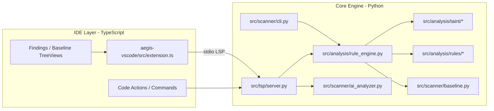

# System Patterns

最后更新: 2026-04-26

## 高层架构

## 模块边界

### VS Code extension

- 负责编辑器生命周期、命令注册、状态栏、TreeView、Webview、LSP client 和 bundled backend 启动。
- 不应该重复实现核心漏洞判断逻辑。
- 任何 Webview / Markdown / HTML 输出都必须把后端 findings 视为 hostile data。

### LSP server

- 负责单文件实时诊断、Code Action、扫描状态和错误可见性。
- 不能静默吞掉影响诊断的异常。
- 应保持与 CLI 扫描逻辑共享核心规则路径，避免 IDE 和 CLI 结果漂移。

### Rule engine

- `src/analysis/rule_engine.py` 是多语言分析入口。
- 对外 API 应稳定，内部可以用统一 `_analyze_with` 或 language -> analyzer/rule mapping 降低重复。
- Regex supplemental findings 只能作为补洞，必须和 AST findings 去重。

### AST rules

- 每类漏洞按语言拆分在 `src/analysis/rules/<vuln_type>/`。
- 新行为必须配套 `tests/rules/<vuln_type>/true_positive` 或 `false_positive` fixture。
- 规则异常应该记录上下文，不能把规则崩溃伪装成“无漏洞”。

### Taint analysis

- `src/analysis/taint/taint_analyzer.py` 和 `source_sink_registry.py` 是 source / sink / sanitizer / propagation 的核心。
- 优先把通用 source / sink 模式沉淀到 registry，避免每个规则各自维护一套。
- Guard clause、sanitizer、source-risk gating 需要用 TP 和 FP 同时覆盖。

## 实现模式

- 先复现: 每个非平凡修复先添加失败测试或记录明确 benchmark root cause。
- 小步修复: 一次只修一个可解释的 FP/FN 类别。
- 指标闭环: target test -> full rules suite -> ruff/typecheck -> benchmark。
- 保持靶场只读: `aegis-ai-core/real_world_targets/*` 只用于扫描和评估。
- 保持报告可追溯: 重要轮次优先摘要到 `memory-bank/progress.md`；需要完整 benchmark artifact 时写入 `aegis-ai-core/reports/`。

## 常见风险

- 过宽 fallback text matching 会造成嵌套 sink 或跨函数同名变量误报。
- Regex 和 AST 同时命中会制造重复 findings，需要 near-line dedup。
- 过度信任 sanitizer 会造成漏报，弱 sanitizer 应按上下文区分。
- AI 修复直接替换代码必须有置信度门槛和复扫路径。
- 老 roadmap 可能落后于当前 README 和 memory bank。
